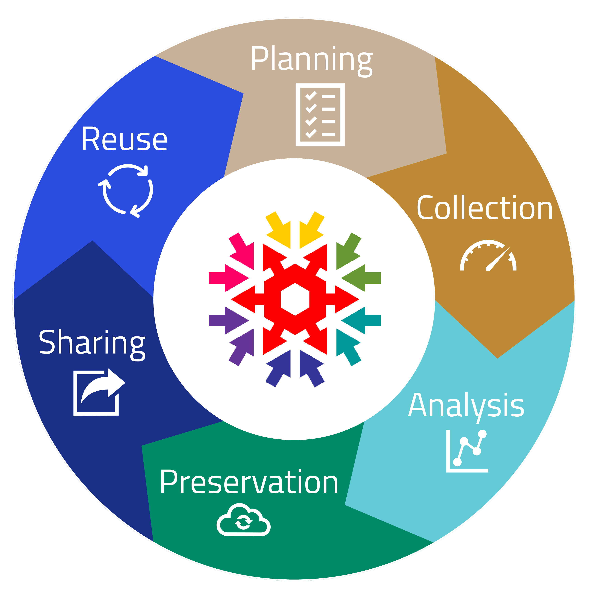

# Research Data Management with NOMAD

## **Towards FAIR Research Data with NOMAD**

Materials science researchers often struggle with managing the diverse and vast amounts of data generated by their work. This is where NOMAD comes in.

NOMAD is a free, open-source data management platform designed specifically for materials science. Its main mission is to ensure that research data adhere to the FAIR principles: Findable, Accessible, Interoperable, and Reusable.

??? info "What are the FAIR Principles?"
    The FAIR principles, introduced by [Wilkinson et al. in 2016](https://doi.org/10.1038/sdata.2016.18){:target="_blank"}, outline a framework for making research data more **Findable, Accessible, Interoperable, and Reusable** (FAIR). These principles emphasize the importance of improving data management to maximize the value of data in research.

    1. **Findable**: Data should be easy to locate, both by humans and machines, using persistent identifiers and descriptive metadata. This includes making data searchable in registries or repositories with unique identifiers.
    2. **Accessible**: Data and metadata should be retrievable by identifiers using standard protocols that are open and free to ensure widespread access. While not all data must be openly available, clear accessibility conditions should be provided.
    3. **Interoperable**: To integrate with other datasets or tools, data should use standard formats and vocabularies, facilitating cross-domain data usage and interoperability.
    4. **Reusable**: Data should have clear and accessible licenses, detailed provenance, and should be well-described to enable reuse in different contexts and by different communities.

    Together, these principles help ensure that data can be found, accessed, combined, and reused effectively across different projects and disciplines. Embracing FAIR doesn’t just make data management smoother—it opens doors to collaboration, accelerates discovery, and gives your data a meaningful, extended life in the research community!

NOMAD provides a comprehensive set of tools that go beyond simple storage to support the entire research data lifecycle. With NOMAD you actively control the following areas of RDM:

- **Data Management**: Structure and organize your data for clarity and ease of access.
- **Data Sharing**: Collaborate securely with colleagues by sharing your data.
- **Data Publishing**: Publish your research data for broader access and use by the scientific community.

    

NOMAD addresses the challenge of managing large amounts of heterogeneous research data, benefiting individual research groups by improving data organization, analysis, collaboration, and knowledge sharing. It ultimately builds a centralized archive of FAIR research data for the entire materials-science community.

## **NOMAD and the Research Data Lifecycle**

The data lifecycle refers to the journey data take throughout their existence. This journey typically involves several stages: data generation or collection, processing for accuracy and usability, analysis to extract insights, secure storage for later access, and eventual sharing with colleagues or the broader scientific community. Following these steps ensures that valuable data are not lost but preserved and fully utilized.

<!--   -->

    

NOMAD will support you throughout the research data lifecycle stages:

- **Planning**: Organize and manage data from the start of your project.
- **Collection**: Use NOMAD's Electronic Lab Notebook (ELN) functionality for structured data documentation. *NOMAD CAMELS* enhances data collection by generating FAIR-compliant data directly from instruments.
- **Analysis**: Post-process and analyze data with *NOMAD Remote Tools Hub (NORTH)*, using tools like Jupyter notebooks for flexible data exploration.
- **Preservation**: Keep data secure with NOMAD’s centralized infrastructure, or use *NOMAD Oasis* for local storage, offering flexibility for your preferred data storage solution.
- **Sharing**: Share your data securely with colleagues. DOIs ensure data visibility and proper citation in publications.
- **Reuse**: NOMAD promotes data reuse with rich metadata and advanced search capabilities. The powerful *API* allows programmatic access for automating data exploration.

<!-- By solving the problem of disorganized and hard-to-find data, NOMAD enhances data management and collaboration at every stage of the research lifecycle. It helps individual scientists streamline their workflows, supports research groups in sharing and building on each other's work, and ultimately contributes to a centralized and accessible archive of valuable research data for the entire materials science community. -->
