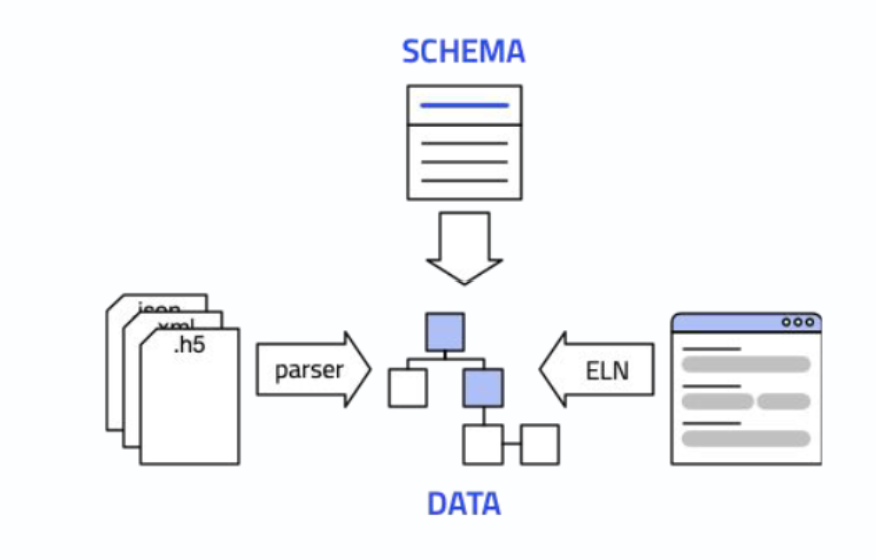

# NOMAD Structures Your Research Data

Structured data is a key component in the journey towards making research data FAIR. NOMAD supports this process by providing predefinec structure for collected reasearch data as well as converting raw files into structured and FAIR-compliant data. This transformation is done through the use of *schemas, parsers, and ELNs*.

??? info "What are structured data?"
    Structured data refers to information that is organized and formatted in a way that makes it easily searchable, understandable, and usable by both *humans* and *machines*. It typically adheres to a predefined model or schema, which dictates how the data is arranged—such as in tables, rows, and columns in a database, or within specific fields in a file format like XML, JSON or HDF5.

    

At the core of the structuring process in NOMAD is the *schema*. Schemas define possible structures for processed data and metadata, organizing this data hierarchically in sections and subsections. They also define the relationships between different pieces of data and their associated metadata. For example, in a schema, the units of a measured quantity are also defined—such that one cannot assign units of length to a value of mass measurement. In essence, schemas are based on ontologies, as they define possible relationships between data and metadata organized within them.

To simplify, a schema is a *design* that defines how the structure and relationship of the data should be. An analogy would be to think of a schema as the blueprint of a toolbox, where the design specifies the location for the tools, once a template based on this schema is created. Some placeholders in the template must be filled with data, while others are optional. For instance, when uploading data to NOMAD, it is mandatory to specify *when*, and *which user* is uploading the data. However, certain fields, such as *whether the data includes a DOI,* are optional.

    

??? details "The NOMAD Metainfo"
    All data in NOMAD follows a schema that defines how the data is hierarchically structured and cross-referenced. This schema is called the [NOMAD Metainfo](https://nomad-lab.eu/prod/v1/gui/analyze/metainfo){:target="_blank"}. It defines a general domain-independent super structure, as well as highly detailed, specialized data from specific methods, tools, and programs.

Based on the chosen or a newly created schema, NOMAD structures data into *sections* and *subsections*, where each section can contain data and additional sections. Without selecting a schema when uploading files to NOMAD, the system treats the files as a block of binary information, functioning merely as a storage service without the organizational benefits; similar to how a service like Dropbox would work.

Creating a schema enables the development of ELNs that exploit the schema to organize data in a FAIR-compliant manner. Returning to the analogy, the schema defines placeholders in the ELN, guiding users on what data or metadata to provide. For example, in an experiment measuring the heating and evaporation rates of water at 120°C, the schema would require temperature units for the temperature field and mass units for the water mass field.

The same principle applies when uploading a file to NOMAD with an available *parser* for this specific file format. The parser is a computer script that goes through your data file and collects the information to fill the placeholders defined by the schema. Therefore, the primary effort lies in preparing a proper schema for your experiment. Once the schema is prepared, the data can be placed in the correct placeholders either *manually via an ELN* or automatically upon uploading a file using a parser. The result is the same: in both scenarios data will be stored in a structured manner as you defined it in the schema.

In summary, the transition from raw files to FAIR data in NOMAD is achieved by careful design and implementation of *schemas* and *parsers*.