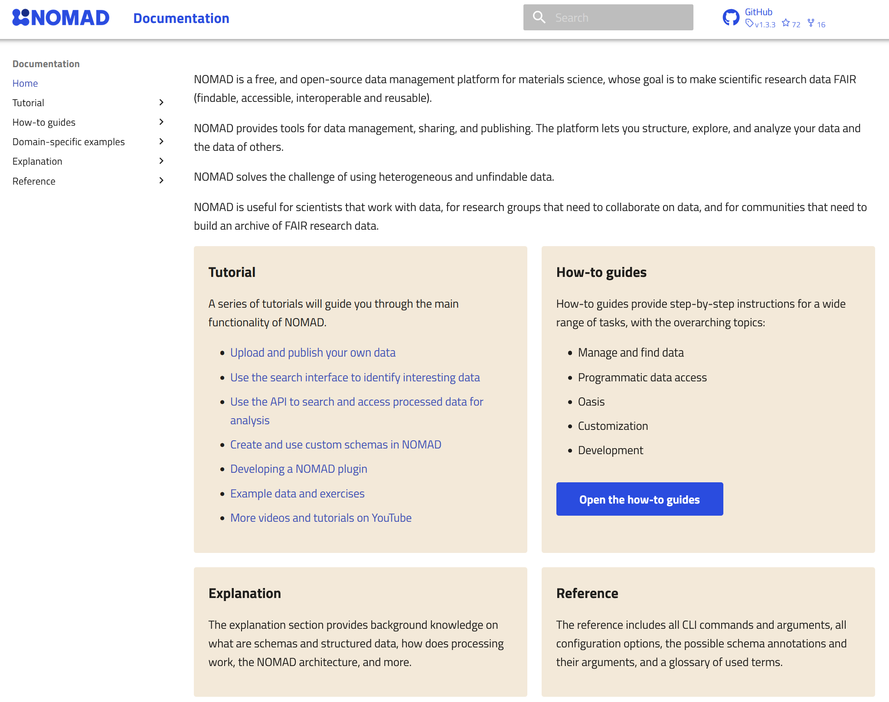

# Getting Support

The following resources are available to provide support and assistance:

### 1. Official Documentation
[The NOMAD Documentation](https://nomad-lab.eu/prod/v1/docs/index.html){:target="_blank"} is a rich resource that explains all the aspects of NOMAD in great detail and provides valuable how-to guides on advanced topics.

    

### 2. Tutorials
Explore the FAIRmat and NOMAD Tutorial series, which cover various aspects of using NOMAD. These tutorials are available on multiple platforms:

- A list of past and upcoming tutorials can be found on our website under [FAIRmat and NOMAD Tutorial Series](https://www.fairmat-nfdi.eu/fairmat/outreach-fairmat/tutorials-fairmat){:target="_blank"}. Also feel free to [subscribe](https://www.fairmat-nfdi.eu/fairmat/outreach-fairmat/registration-fairmat){:target="_blank"} to our email newsletter to be the first to know about the latest news, upcoming events, new videos as well as general FAIRmat updates throughout the year.
  
- YouTube Channel: [The NOMAD Laboratory](https://www.youtube.com/@TheNOMADLaboratory){:target="_blank"}
  
- Zenodo: [FAIRmat NFDI Community](https://zenodo.org/communities/fairmat_nfdi/records?q=&f=resource_type%3Avideo&l=list&p=1&s=10&sort=newest){:target="_blank"}

    

### 3. Interactive Communication on Discord
Join the [NOMAD Discord Channel](https://discord.com/invite/Gyzx3ukUw8){:target="_blank"} for interactive and casual communication with other users and support from our developers. There you may find several sub-channels focusing on specific topics.

    

### 4. Additional Support Channels
- **NOMAD GitHub Repository:** Check the [NOMAD GitHub](https://github.com/nomad-coe/nomad){:target="_blank"} for issues, discussions, and community support. You can open an issue on [NOMAD's main GitHub project](https://github.com/nomad-coe/nomad){:target="_blank"}. This way, we can track your problem and start implementing a solution.
- **Community Forum:** Participate in the [NOMAD User Forum](https://matsci.org/c/nomad){:target="_blank"} to ask questions and share experiences with other users.
- **Email Support:** If the options mentioned above are not appropriate for your problem, feel free to contact us via email. We will respond as soon as possible: support@nomad-lab.eu.
