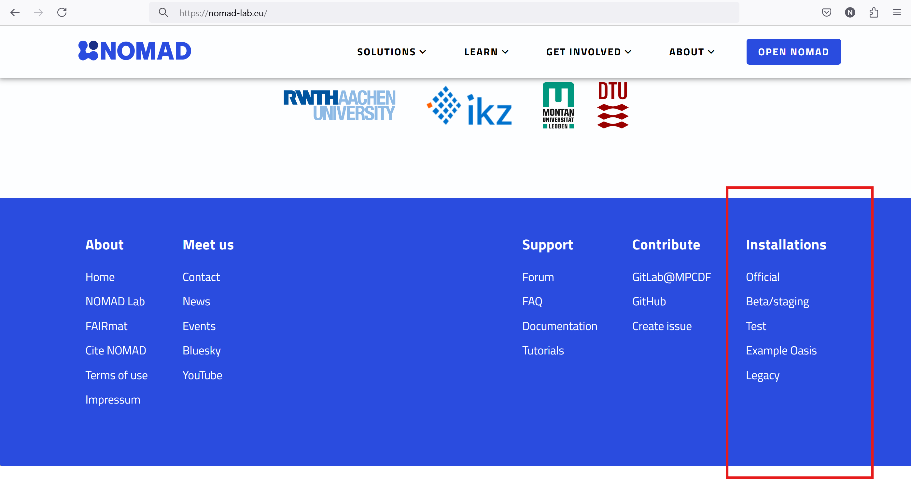

# Navigating to NOMAD

The [NOMAD landing page](https://nomad-lab.eu/nomad-lab/) provides an overview of different NOMAD solutions as well as its features and functionalities, along with links to documentation, tutorials, and project history. This is the starting point for accessing the NOMAD, where you can upload, manage, and explore data.

You can access the official NOMAD by clicking on the blue ``OPEN NOMAD``
button on the top right of the page.

However, there are other access points to NOMAD. While in this Module we mainly focus on using the official NOMAD release, it is worth to have a brief overview of other NOMAD installations. In order to see the list of these installations, scroll down the The [NOMAD landing page](https://nomad-lab.eu/nomad-lab/) to reach the bottom of the page, and locate **Installations** header at the right side of the bottom blue ribbon.

### Official NOMAD (Production)

- **Access the stable version:** Click the "Open NOMAD" button at the top of the landing page to access the stable version of NOMAD. This is the main public version where you can reliably upload, manage, and explore data.

### Beta/Staging NOMAD

- **Explore new features:** Access the latest features and updates, though it may include unstable or untested features. You can navigate to this version in two ways:
  1. Use the link at the bottom-right corner of the landing page.
  2. Navigate through the top menu by selecting "SOLUTIONS" > "NOMAD" > "Try and Test."

### Test NOMAD

- **Test Environment:** This version of NOMAD is a testing installation, separate from the official data. Please note that any data you upload here may be temporary and could be lost.

### Example Oasis

- **Demonstrating NOMAD OASIS:** This installation showcases how NOMAD OASIS can be adapted to different research disciplines, highlighting its flexibility.

### Legacy NOMAD

- **Access the Legacy Version:** For those who need it, the old version of NOMAD is still available.

