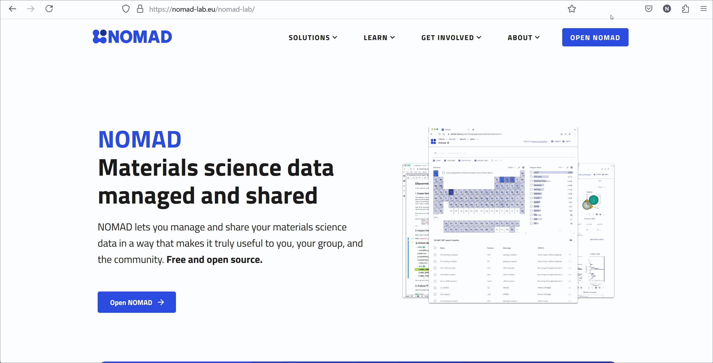

# Create a NOMAD user account

Creating a NOMAD account is quick:

1. Visit [nomad-lab.eu](https://nomad-lab.eu){:target="_blank"}: Click on **OPEN NOMAD** in the top right corner.
2. Click on **LOGIN / REGISTER** and select **Register**.
3. Fill out the form. You are asked to enter a username (e.g., firstname.lastname), create a password, and provide your first name, last name, affiliation, and email address.
4. Confirm your registration using the link sent to your Email.

