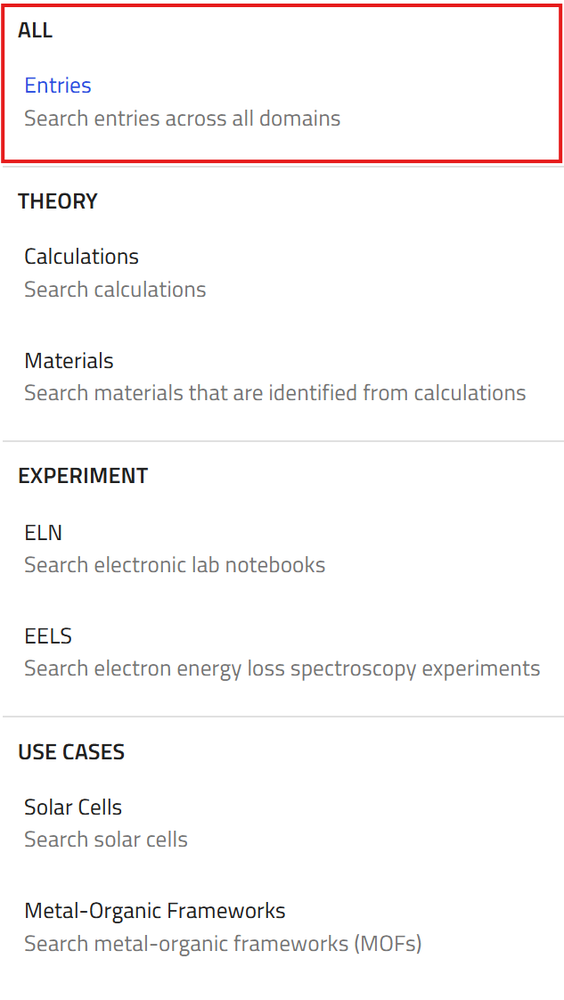

# Explore Data in NOMAD

The **EXPLORE** menu allows you to navigate and search through a vast amount of materials-science data. Currently, the this menu offers several options for exploring data including:

- **Entries**: Search entries across all domains.
- **Theory**: Focus on calculations and materials data derived from theoretical models.
- **Experiment**: Explore data from experimental sources, such as ELNs (Electronic Lab Notebooks) or characterization techniques e.g., EELS (Electron Energy Loss Spectroscopy).
-  **Tools**: Explore among several AI toolkit notebooks.
- **Use Cases**: Search data tailored to specific use cases, such as Solar Cells or Metal-Organic Frameworks (MOFs).

In this section, we focus on searching data in NOMAD using the **Entries** option within the **EXPLORE** menu. You will see an overview of **USE CASES**, using Solar Cells example, in [a later section](M2_x_explore_use_cases.md).

### Explore NOMAD Using Entries

To begin exploring NOMAD using entries, select **Entries** from the **EXPLORE** menu.

??? details "What are **Entries** in NOMAD?"

    Entries are individual simulations, workflows, or measurements that have been uploaded to NOMAD. Each entry contains detailed metadata, making it possible to be searched,analyzed, and reused.

    

This page contains all entries available in NOMAD, showing the top 20 latest uploaded entries. Without logging in, only publicly available entries are visible. Once logged in, you can also access entries you created or those shared with you.

### Main Search Interface

With millions of entries, mostly consisting of electronic structure calculations, NOMAD is expanding to include a broader range of materials science and physics data. This now includes sample data, measurements, characterization, and theoretical data at different scales. In fact the search interface is already revised to allow the increasingly complex filter options that are required for a wider range of entry types. The filter menu on the left allows you to create complex searches based on different perspectives, including:

- **Material**: Filter by elements, chemical formula, or structure/symmetry.
- **Method**: Filter by the scientific method used, such as various DFT codes.
- **Properties**: Filter by desired properties, such as electronic properties.
- **Use Cases**: Filter data relevant to specific applications, like solar cells.
- **Origin**: Filter based on the data's origin, such as the author or date of upload.

    

### Material Filter

Let's start with a search based on material structure. The **Elements / Formula** filter menu allows you to filter entries by specific elements or chemical formulas. For instance, if you are interested in hexagonal boron nitride, select the B and N from the periodic table. As you select elements, the user interface dynamically updates, narrowing down the search results and altering the heatmap accordingly.

The applied filters are displayed in their respective submenus, and you can remove individual filters or clear all filters to reset your search. The principle remains the same across different filter types — whether you are using the periodic table, formula input fields, structure/symmetry filters, or properties filters, your search is refined progressively.

For example, you could filter down to materials with only two atoms of B and N, and further narrow it to those with hexagonal symmetry. The available filter options will adjust based on your selections, ensuring that the filters remain relevant to the data you are exploring. To be more clear, once you select the hexagonal symmetry, the Bravais lattice options relevant to the cubic symmetry disappear.

### Method Filter

Under the **Method** menu, you can control the applied physics method. This allows you to specify whether you are looking for simulation data (e.g., DFT) or experimental data (e.g., EELS). For example, you could filter h-BN data down to only those entries created using VASP.

### Properties Filter

The **Properties** filter menu allows you to focus on specific calculated or measured properties. For example, if you are interested in electronic properties, you can filter entries to display only those with available band structure or density of states data etc.

### Adding the Filters to the Search Interface

You can customize your search interface by pinning filter items from any filter (sub)menu to the search page. Clicking the **(+)** button adds the selected filter to your custom search dashboard, allowing you to use them side by side.

This feature helps uncover relationships within the data on NOMAD. For example, selecting Boron and fixing the symmetry to hexagonal might reveal a pattern where many entries involve elements from group 5 in the periodic table, reflecting the abundance of III-V semiconductor data in NOMAD.

> **Important Note:** The relationships you observe through the filters are dependent on the data published in NOMAD. Interpret them within the context of the available data, as they do not necessarily carry an inherent physical or scientific meaning.

    

### The Search Bar

A very useful tool to explore entries in NOMAD is the search bar, which allows you to quickly find and apply filters. When you type anything in the search bar, NOMAD searches within various places and suggests matching filters. This is particularly helpful if you are unsure wheter a filter exist at all, or where it is located. For instance, entering a program name, functional name, or colleague’s name will reveal corresponding filters.

??? question "Do you think a bandgap filter exist?"
    How will you find out if there is a filter for bandgap of materials in NOMAD? Does it give the bandgap value or the direct/indirect characteristic?

??? tip "Hint"

    - Try different terms or combinations of the words that seem logical or intuitive to you in the search bar. In this case it might includng "bandgap", "band gap", "band_gap" etc. Look at the search bar suggestions, to see if you can find the one you were looking for. Do the same for "direct" or "indirect".

