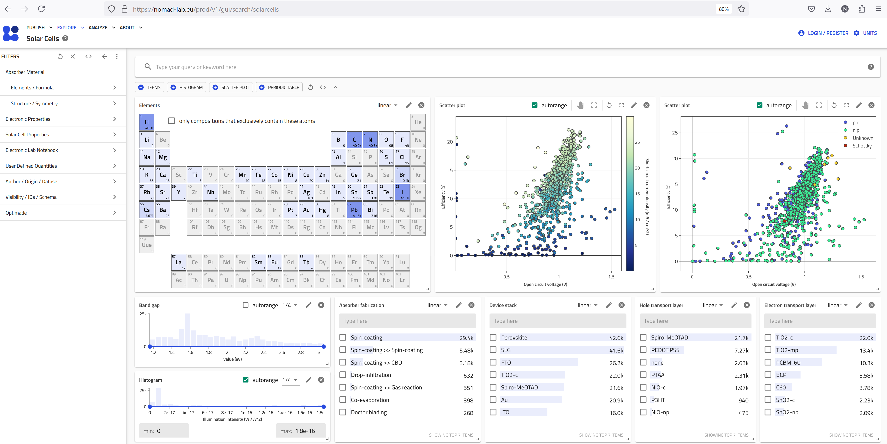

# Exploring Data through Use Cases (Apps) in NOMAD

The **USE CASES** option in the **EXPLORE** menu in NOMAD is designed to help researchers discover domain-specific data tailored to their research needs. By focusing on predefined categories, use cases provide an efficient approach to exploring datasets relevant to specific scientific domains, ensuring that researchers can find the most relevant data and use the dashboards readily designed for this purpose.

    

## What are Use Cases?

Use cases in NOMAD refer to predefined categories of data that have been uploaded to NOMAD according to specifically designed schemas to meet the needs of a target research community. These categories are designed to help researchers quickly locate data that is most relevant to their field of study, without the need to explore large amounts of unrelated data. The schemas for use cases have been carefully and meticulously designed by domain experts in FAIRmat in tight collaboration with PIs in that specific field coming from a global research community.

## Currently Available Use Cases

NOMAD currently offers two use cases:

- **Solar Cells:** Focuses on data related to the development and analysis of solar cell technologies. This includes data on photovoltaic materials, device performance, and related simulations.
- **Metal-Organic Frameworks (MOFs):** Covers data relevant to the study of MOFs, which are materials composed of metal ions coordinated to organic ligands. This use case includes structural data, adsorption properties, and related chemical simulations.

The FAIRmat community is actively working on expanding/advancing the use cases to other domains. The use cases with expected releases in the near future are:

- **Heterogeneous Catalysis:** Focuses on data related to catalytic processes, including catalyst design, reaction mechanisms, and efficiency.
- **Batteries:** Encompasses data on battery materials, electrochemical performance, and simulations relevant to energy storage technologies.

## How to Explore Data Using the **USE CASES** Page

The **USE CASES** page in the EXPLORE menu is designed to facilitate exploring data in that specific field. Once you choose a use case, a predefined dashboard containing various important widgets which offer key information and visualizations to explore and analyze the data (that comply with that use case schema) is presented. Each research topic may have details and intricacies that the predefined dashboard does not address. However, NOMAD offers high flexibility, allowing you to edit the dashboard to meet your needs or add your own visualizations.

## Advanced Tips for Using the **USE CASES** Page

To make the most out of the use cases feature, consider the following tips:

- **Combine Filters:** Use multiple filters to narrow down your search results more precisely. For instance, you can combine material filters with performance metrics to find specific data points within the Solar Cells use case.
- **Customize Your Search:** Pin frequently used filters to your search interface for quicker access in future sessions. This can be particularly useful if you regularly search within the same use case.
- **Interpret Data Relationships:** Use the visual tools provided in NOMAD, such as histograms and scatter plots, to discover relationships between different data points within a use case. This can provide deeper insights into the data and help guide your research.

## An Example for Solar Cells

Let's proceed with an example to address a specific research question within the domain of solar cell.

Suppose we are working on Sn-based solar cell research, and the project is about using C60 as an electron transport layer in solar cells. We fabricated solar cell devices with an absorber material that contains Sn. The device's structure is illustrated below:

    

Now, we want to answer the following research question:

**Which hole transport layer (HTL) materials improve efficiency in Sn-based solar cells with C60 as the electron transport layer (ETL)?**

1. Start by navigating to the **EXPLORE** menu in the NOMAD GUI. From here, select **Solar Cells** under **USE CASES**.

2. Once you have selected the **Solar Cells** use case, you will be presented with a predefined search dashboard optimized for research in solar cells. This interface allows you to apply filters readily and easily narrow down the data to what is most relevant for your research.

    

### Dashboard Overview

- **Periodic Table:** Used to filter the elements of your main absorber material. For the HTL and ETL, other filters should be used.
- **Scatter Plot:** Visualizes the solar cell efficiency (y-axis), open circuit voltage (x-axis), and the short circuit current density (color map). This important plot provides insights on the relationship between efficiency and these electrical properties.
- **Scatter Plot:** Visualizes the solar cell efficiency (y-axis), open circuit voltage (x-axis), and the solar cell architecture, either p-i-n (pin) or n-i-p (nip) or Schottky. If it is not defined, it is marked as unknown.
- **Histogram:** Displays the bandgap of the solar cells data uploaded to NOMAD. It is interactive, meaning that you can use it to show the range that you are looking for.
- **Histogram:** Shows the illumination intensity, providing insights into the testing conditions for the solar cells.
- **Interactive TERMS Plot:** Categorizes the method for the fabrication of the absorber layer.
- **Interactive TERMS Plot:** Categorizes the device stack, providing information on the configuration of the solar cell layers.
- **Interactive TERMS Plot:** Categorizes the materials used for the ETL.
- **Interactive TERMS Plot:** Categorizes the materials used for the HTL.

3. **Apply Filters:** Use the filters provided to refine your search. In our example, we are looking for Sn-based solar cells with C60 as the ETL. So let's choose Sn in the periodic table and fix the ETL on C60 in the interactive TERMS plot. These filters narrow down the results to about 400 entries. Add more filters if your research question can be better answered. For instance, if you are looking for absorber materials with band gaps greater than 1.3 eV, you can use the slider on the interactive bandgap histogram to narrow down your search further. Or, if you are only looking for pin architecture, click on pin on the respective scatter plot to filter down the results only to the ones with pin.

4. **Modify or Add Customized Widgets:** All the widgets on each dashboard are customizable. By clicking on the pen icon on the top right of each widget, you can access the customizable quantities of that widget. For example, you can change the entity plotted on a specific axis, the color map, or the units in which that specific quantity is presented.

5. **Explore Results:** Review the search results to find data entries that match your criteria. Here you can also look for specific entries in different visualizations. For example, you can zoom in on the scatter plots and hover your mouse pointer over each data point to read the value of the plotted entities. Clicking on each data point will bring you to the entry page. Each entry provides detailed metadata and links to the associated datasets, making it accessible for researchers to find and use the most relevant data for their work.

    

In summary, the USE CASES (or apps) option in NOMAD EXPLORE menu offer a powerful way to explore domain-specific data, making it easier for researchers to find and use the most relevant data for their work. By leveraging these predefined categories and advanced search tools, you can streamline your data discovery process and focus more on advancing your research.
