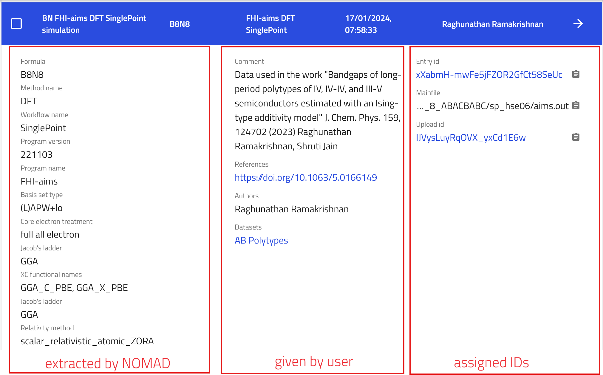

# Exploring Uploaded Data in NOMAD

## Inspecting the Entries in the Explore Page

In the [previous section](M2_x_explore_tab.md), we learned how to use the GUI filter menu, to filter the entries which match our search criteria. Now let's look at the the search results in more details. In the center of the page, you will find a list of all entries that fulfill our chosen search criteria. By default, the GUI lists the 20 newest entries first, but we can load more entries by clicking on the **LOAD MORE** at the bottom of the list.

You can also customize the columns displayed by using the button with three vertical thick lines on the top right.

    

Clicking on an entry (anywhere except on the right arrow!) brings up a brief overview of key metadata. On the left, we have the metadata extracted from the uploaded file by the NOMAD parsers; in the middle, we have the user-provided metadata; and on the right, we have the persistent identifiers for the entry and its upload, as well as, the path for the file in NOMAD.

    

## Opening the Entry Page

Clicking on right arrow next to an entry navigates you to the respective entry page. On the entry page, you will see a general overview of the entry.

- On the left, core metadata are displayed again.
- On the right, various cards present the available information. The cards you see depend on the properties or data available for that entry.

For instance, here we see cards for the electronic properties that we searched for in the [previous section](M2_x_explore_tab.md). The electronic properties card shows us the band structure and density of states. These are interactive; you can zoom in and move them around. You might also see a picture of the Brillouin Zone and information about possible bandgaps etc. Note that the availability of certain information may differ from entry to entry.

    

## Raw and Processed Data in the **FILES** and **DATA** Tabs

After we could see an overview of the entry in the entry page, we might be interested to inspect more details:

1. **FILES** Tab: This tab shows the uploaded files. NOMAD lists all files in the same directory, as they usually belong together. The mainfile for this entry is displayed at the top. For example, if it is a VASP run, the mainfile would be the XML file. All the information in this entry are created from those files. You can preview text files and download all or individual files.

??? details "What is a Mainfile?"
    Each entry has one raw file that defines it, referred to as the **mainfile**. Typically, most, if not all, processed data of an entry is derived from this mainfile.

2. **DATA** Tab: Also known as the "processed data" tab, this shows the results of the parsing and normalization process done by NOMAD. NOMAD puts all the data in a unified, hierarchical, and machine-processable format, following the NOMAD metainfo.

    

