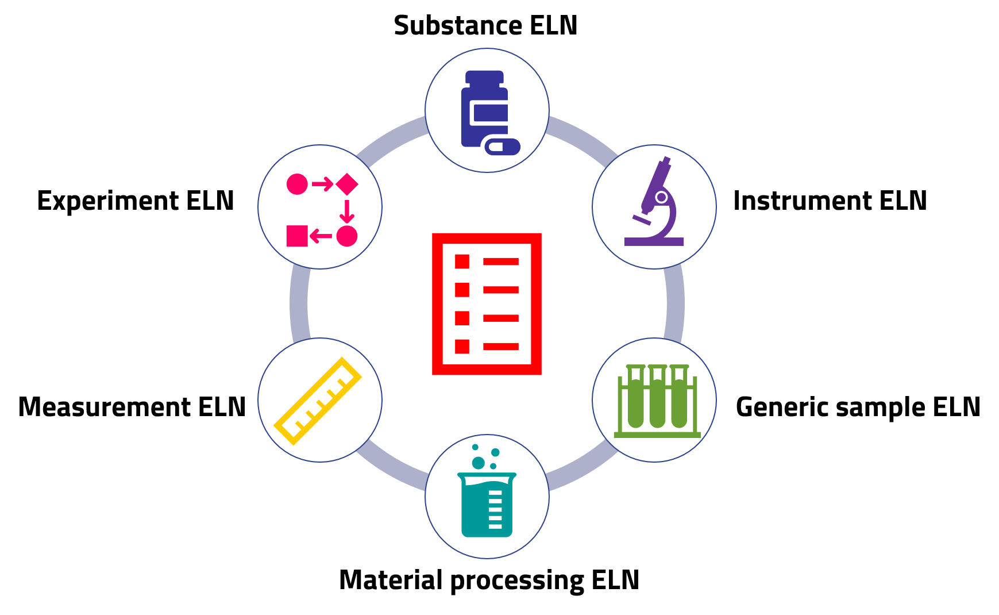
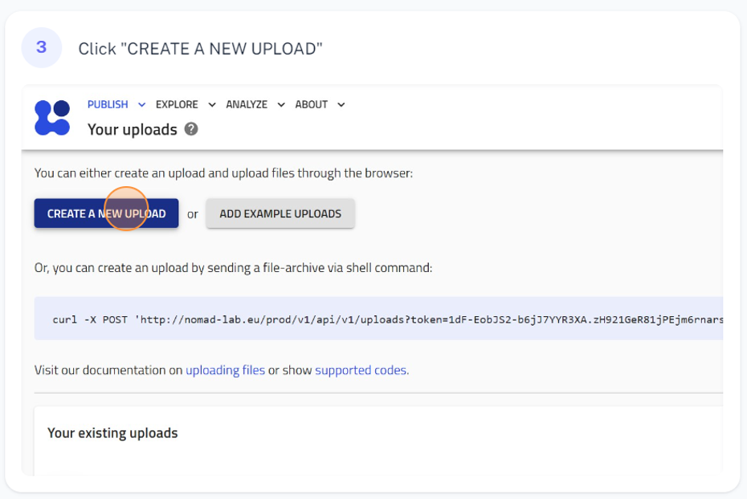
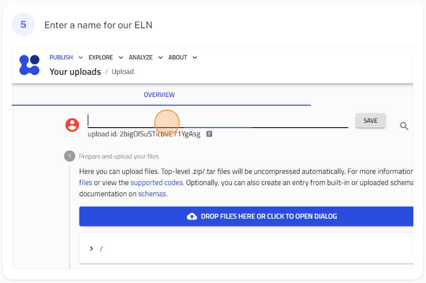

# Getting started
## **Creating NOMAD entries using the ELN built-in schemas**
In this section, we will show you how to use NOMAD's built-in ELN schemas to plan, document, manage, and share your experiments in the lab.

As a researcher, the first step in effectively conducting your experiments to achieve the results and conclusions of your work begins with planning.

Planning experiments involves creating a record of all the materials and instruments that will be used during your experiment, or **entities**. In addition, the conditions under which the materials will be processed and the methods of measurement will be outlined, i.e., **activities**.

This record in NOMAD is made by creating entries for each entity and activity that will be used in your experiments.

To create entries for your ELN using the NOMAD's built-in schemas, the following  general steps should be followed:

| [[Previous]](5A_0_Getting_started.md) |   Creating NOMAD entries using the ELN built-in schemas| [[Next]](5B_0_Creating_entities.md)
|------------|-----------|-------|