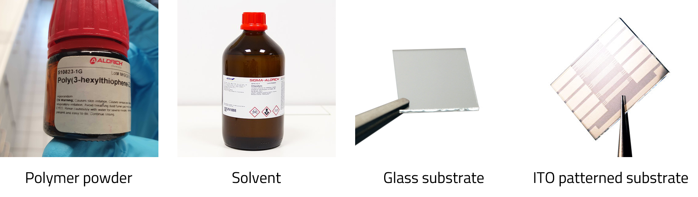
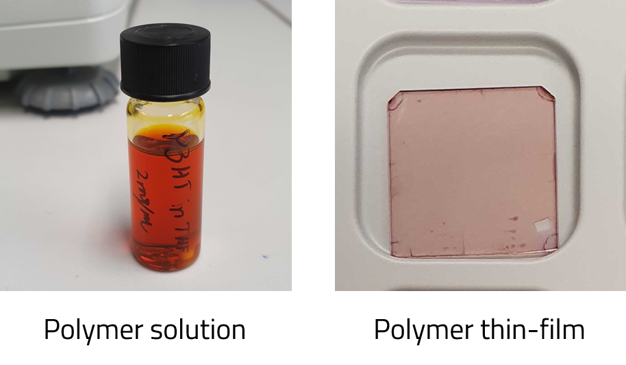
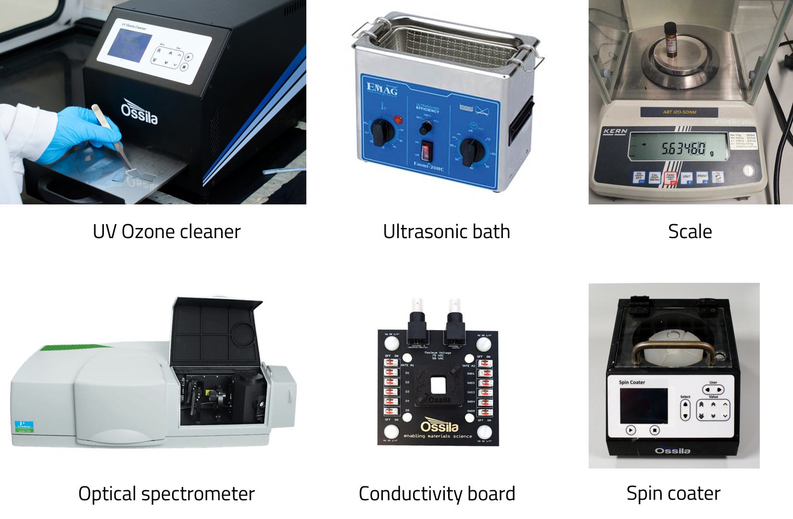

# Create Entries for the Entities Used in Your Experiments

Recording entities in NOMAD is done by creating entries for each entity.

Entities are objects that are used throughout your experiments, and can include the following:
1. **Substances** or raw materials used to create samples.
2. **Samples** to be examined.
3. **Instruments** used to create and measure the samples.

For example, consider a simple experiment where you need to prepare polymer solutions and then deposit them on substrates to create thin film samples. Then, you want to measure the optical absorption spectra and/or the electrical conductivity of your samples.

To do this, you need your solute (polymer powder) and solvent to make the solution at a predefined concentration. Then you will deposit your thin film on a pre-cleaned substrate to create your samples. 
The polymer powder, solvent, and substrate are considered to be the **substances** used to create your **samples**, i.e. the solution and the thin film. 
<figure>
    
    <figcaption><i>Examples of substances that will be used throughout your experiment.</i></figcaption>
</figure>

<figure>
    
    <figcaption><i>Examples of samples that will be prepared in your experiment.</i></figcaption>
</figure>

In the process of preparing your **samples**, you will use several **instruments**, such as a balance, UV-Ozone cleaner, sonicator, and spin coater. 

Once the samples are ready, you will use another set of **instruments** to measure the optical absorption spectrum and electrical conductivity, i.e., a UV-Vis-NIR spectrometer and an electrical characterization setup, respectively. 

<figure>
    
    <figcaption><i>Examples of instruments that will be used to prepare and measure your sample.</i></figcaption>
</figure>

NOMAD provides built-in schemas for the three entities mentioned above, with input fields to define them. Creating entries using these built-in schemas allows you to use these entries for other ELN entries and workflows within NOMAD. 

Let's get hands-on and create entries for the different entities that will be used in this sample experiment. 

1. Substances
2. Samples
3. Instruments

