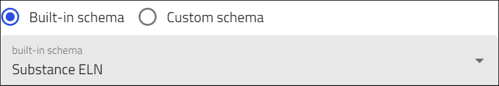
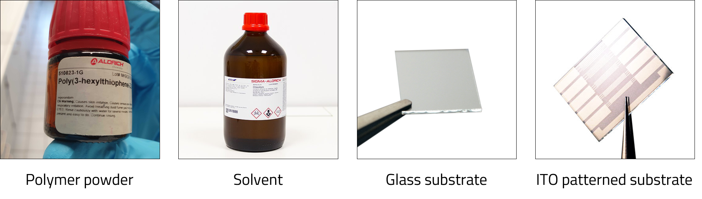
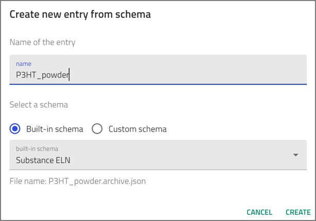
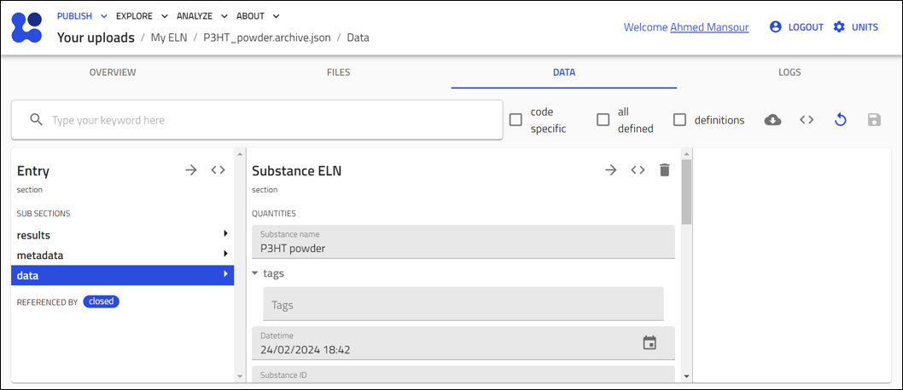

# Create Entries for your Substances Using the *Substance ELN* Schema

    

In this section you will learn how to create NOMAD entries for entities that will be used as substances in your experiments. You will use NOMAD's built-in schema, called the *Substance ELN*, and explore the various fields you can populate and the information you can add to NOMAD. 

Based on the example described earlier, we will need to create entries for the following substances:

1. P3HT powder
2. Chloroform
3. Glass substrate
4. Pre-patterned ITO substrates

    

> For general steps on how to create an entry in NOMAD using the built-in ELN schema, see the section [Entries in NOMAD](M3_2_1_creating_entries_built-in_schema.md). When you reach the step 8, select **Substance ELN** from the drop down menu, enter a name for your record, and click **CREATE**. 

    

After clicking the **CREATE** button, NOMAD will automatically perform the following tasks:

1. NOMAD creates a file for the entry, using the format *.archive.json*.
2. The entry file is stored in the main upload directory. 
3. NOMAD will open the entry, switch to the *DATA* tab, and open the *data* subsections page. 

The *data* subsections page allows user to fill in the information about the substance. 

    

The *Substance ELN* built-in schema provides several fields that allow input of different quantities:

* Substance name: This is the name of the input file created.
* Datetime: Allows entry for a date/time stamp.
* Substance ID: A human-readable ID that is unique for the substance within the lab. 
Can be manually entered.

* Detailed Substance Description: A free text field that can be used to enter any additional information about the entry. 

> Remember, for this ELN you are using a built-in schema that was created to be as generic as possible to accommodate a wide range of users. You can use the different fields in ways that best suit your needs. For example, the Datetime field can be used as a timestamp for opening the polymer container, purchase date, or entry creation date. 

The *Substance ELN* allows you to include additional information for your entity by using subsections. 

These can be found at the bottom of the Entry/Data/data page and include:

* Elemental composition
* Pure substance
* Substance identifier

    

### *elemental_composition* Subsection:

Here you can create quantities to define the chemical composition of your substance. You can add the chemical element, its atomic fraction, and its mass fraction. 
Add as many elements as needed to represent your substance. This section is useful for chemical substances.

### *pure_substance* Subsection:

Here you can define your substance as a pure material purchased from an external vendor. This subsection allows data entry based on three different definition types.

* PubChem
* CAS
* General

Regardless of the selected definition type, all pure substance subsections contain the following fields:

* Substance name
* IUPAC name
* Molecular formula
* Molecular unit
* Inchi
* Inchi Key
* Smile button
* Canonical Smile
* CAS Num
