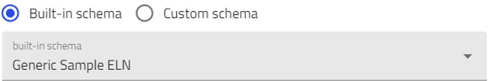
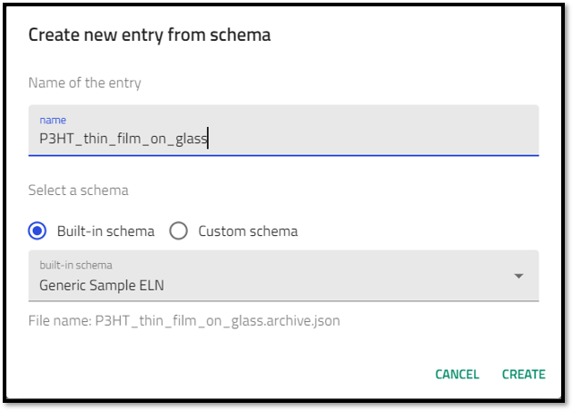
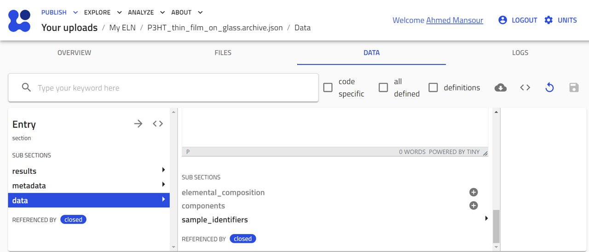

# Creating Entries for Your Samples Using the *Generic sample ELN* Schema

In this section, you will learn how to create NOMAD entries for entities that will be the samples used or produced in your experiments. You will use the NOMAD built-in schema called Generic Sample ELN and explore the various fields you can populate and the information you can add to NOMAD. 

Based on the example described earlier, we need to create entries for the following entities:
1. P3HT Thin Film
2. P3HT Solution

> For general steps on how to create an entry in NOMAD using the built-in ELN schema, see the section [Entries in NOMAD](M3_2_1_creating_entries_built-in_schema.md). When you reach the step 8, select **Generic Sample ELN** from the drop-down menu, enter a name for your entry, and click **Create**.

After clicking the **Create** button, NOMAD will automatically perform the following tasks:
1. NOMAD creates a file for the entry, using the format *.archive.json*.
2. The entry file is stored in the main upload directory. 
3. NOMAD will open the entry, switch to the *data* tab, and open the *data* sub-sections page. 

The *data* sub-sections page allows users to input information about the substance. 

The built-in generic ELN schema provides general fields that allow the entry of various quantities: 
* Short Name: This is the name of the record file created.
* Datetime: Allows input for a date/time stamp. 

* ID: A human readable ID that is unique to the substance within the lab. 
can be entered manually.

* Description: A free text field that can be used to enter any additional information about the entry. 

> Remember that this is your ELN and you are using a built-in schema that was created to be as generic as possible to accommodate as many users as possible. You can use the different fields however you like. For example, the Description field can be used to add any batch information, lab conditions, storage location, etc.

The generic ELN allows you to include additional information for your samples by using sub-sections. 

These can be found at the bottom of the Entry/Data/Data page and include:

* Elemental Composition

* Components

* Sample identifier

## Elemental Composition Sub-section:
Here you can create quantities to define the chemical composition of your sample. You can add the chemical element, its atomic fraction, and its mass fraction. 
Add as many elements as needed to represent your samples. 

## Components Sub-section:
Here you can provide more information about your sample based on the components it is made up of. 
The Components subsection provides three different ways to add this information:

1. Component
2. System Component
3. Pure Substance Component

The System Component section allows the user to select from the substances created in the ELN as components for the sample. This allows you to link your intended product to the raw materials and allows you to track and identify potential impurities or batch variations if the results suggest it. 
Note that only items such as Samples or Substances can be selected in the System Component section.

For the P3HT thin film sample, we can select the components as the solution used to prepare the sample and the glass substrate. 
