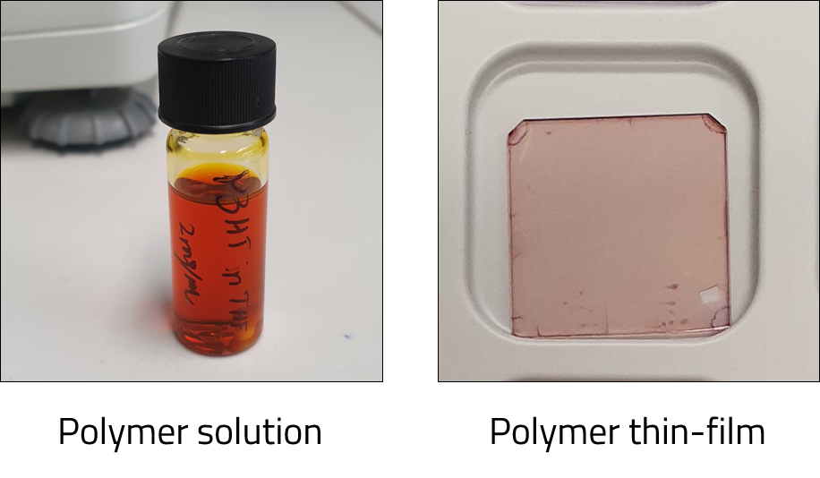
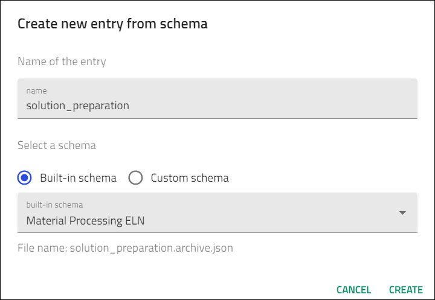
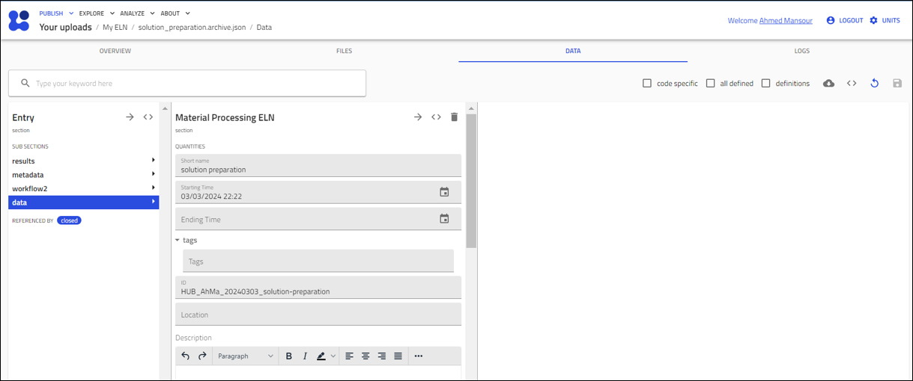
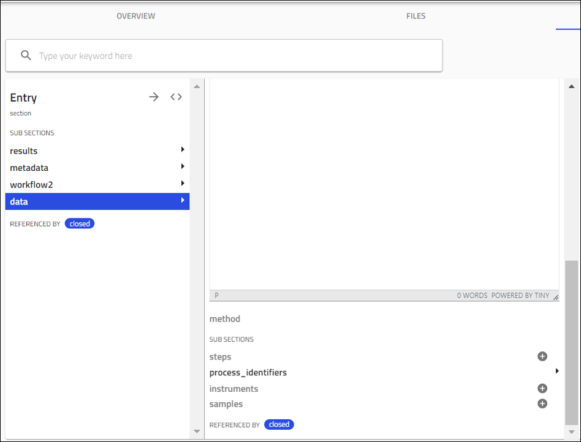
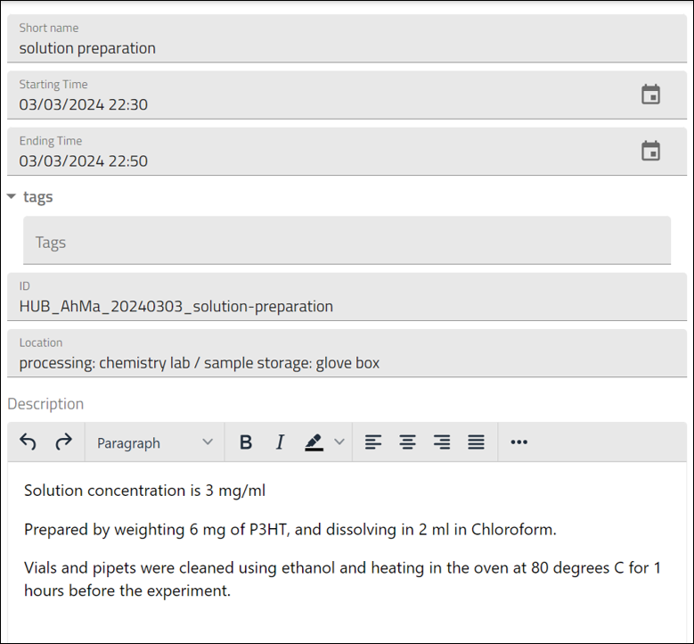
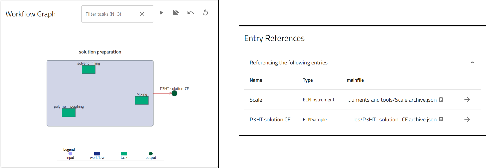

# Create Materials Preparation Activities Using the *Material Processing ELN* Schema

    

In this section you will learn how to create NOMAD entries for activities that will be used to describe the sample preparation process in your experiments. You will use the NOMAD built-in schema called *Material Processing ELN* and explore the various fields you can fill in and the information you can add to NOMAD.

Based on the example described earlier, we will need to create entries for the following processes:

1. Preparation of P3HT solution in chloroform.
2. Preparation of P3HT thin film on glass.
3. Preparation of P3HT thin film on prepatterned ITO substrate.

    

> For general steps on how to create an entry in NOMAD using the built-in ELN schema, see the section [Entries in NOMAD](M3_2_1_creating_entries_built-in_schema.md). When you reach the step 8, select **Material Processing ELN** from the drop down menu, enter a name for your record, and click **CREATE**. 

    

After clicking the **CREATE** button, the following tasks are automatically performed in NOMAD:

1. NOMAD will create a file for the entry using the *.archive.json* format.
2. The entry file is stored in the main upload directory. 
3. NOMAD will open the entry, switch to the *DATA* tab, and open the *data* subsections page. 

The *data* subsections page allows user input to fill in the information about the substance. 

    

The built-in Material Processing ELN schema provides several fields that allow you to enter different quantities:

* Short name: This is the name of the input file created.
* Starting Time and Ending Time: Allows you to enter a date/time stamp for the start and end time of your process. 

* ID: A human readable ID that is unique to the substance within the lab. 
Can be manually entered.

* Location: A text field that can be used to specify the storage location of your sample or the location where it was prepared. 

* Description: A free text field that can be used to enter any additional information about the entry. 

> Remember, for this ELN you are using a built-in schema that was created to be as generic as possible to accommodate a wide range of users. You can use the different fields in ways that best suit your needs. For example, the Description field can be used to provide information about the synthesis process, environmental conditions, or any relevant observations. 

The Material Processing ELN allows you to include additional information for your activities by using subsections. 

These can be found at the bottom of the Entry/DATA/data page and include

* *steps*

* *instruments*

* *samples*

    

First, we add the relevant information about our process as quantities in the main fields, which will define the main quantities for our activity record.

    

The next step is to record the steps performed during the solution preparation process.

The *steps* subsection can be used to create multiple steps as needed. 
Let's create the following steps:

1. powder_weighing: Weigh 6 mg of P3HT.
2. solvent_filling: Fill 2 ml of chloroform into a vial.
3. mix: add the polymer powder to the sovent vial. 

    

Continue by adding the connection of your process to the instrument used and the resulting sample entities.

Note that the added information in the subsections will be used to automatically fill in the **Workflow** section as tasks, as well as the *References* section, which can be viewed in the *Overview* page.

    

You can modify the workflow section by adding additional information such as inputs, additional tasks, and outputs. 
To do this, click on the **Workflow2** section in the side pane. 

Let us add the substance entities we created for P3HT powder and chloroform solvent as inputs to our process.
The changes will be reflected in the Workflow section and the Reference section of the *Overview* page.

    

