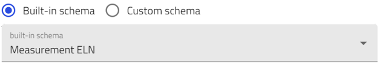

# Create Measurement Activities Using the *Measurement ELN* Schema

In this section, you will learn how to create NOMAD entries for activities that  describe the measurements in your experiments. You will use the NOMAD built-in schema called *Measurement ELN* and explore the various fields you can fill in, as well as the information you can add to NOMAD.

Based on the example described earlier, we will need to create entries for the following processes:

1. Measuring the optical absorption spectra.

2. Measuring the electrical conductivity.

> For general steps on how to create an entry in NOMAD using the built-in ELN schema, see the section [Entries in NOMAD](M3_2_1_creating_entries_built-in_schema.md). When you reach the step 8, select **Measurement ELN** from the drop-down menu, enter a name for your entry, and click **Create**.
>

