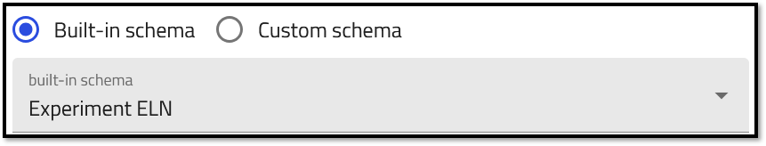
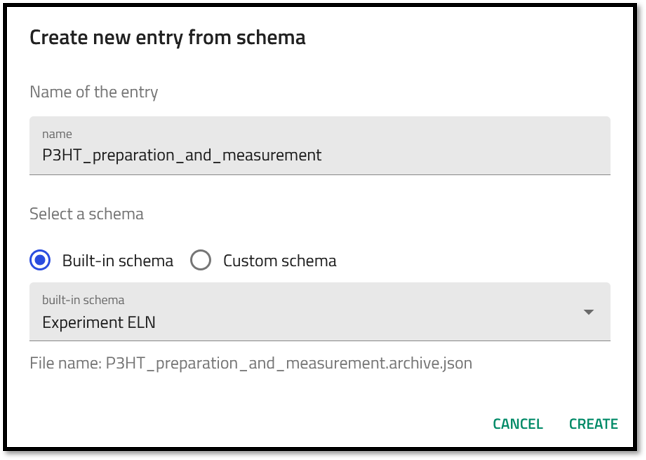
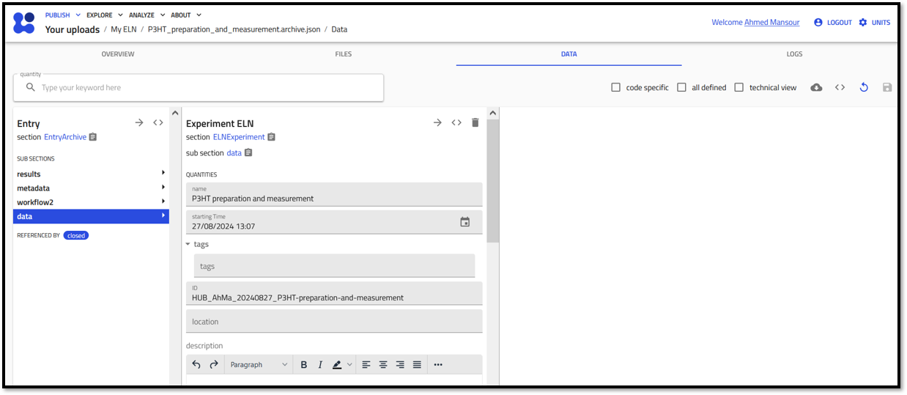
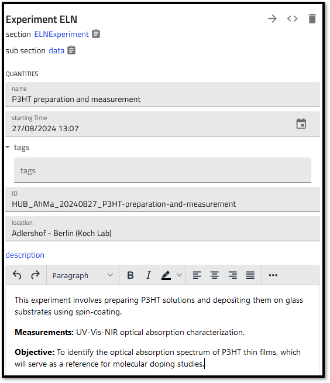
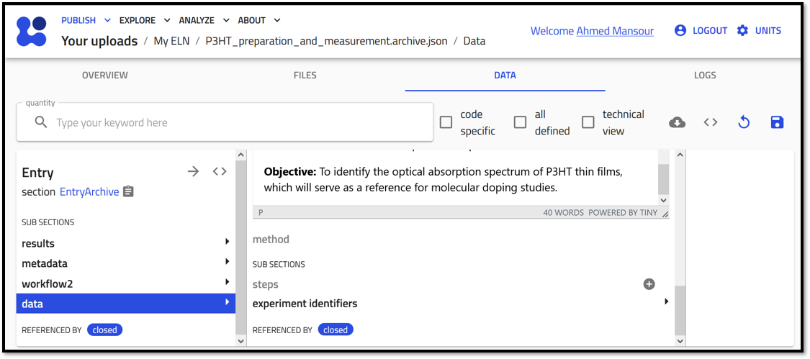
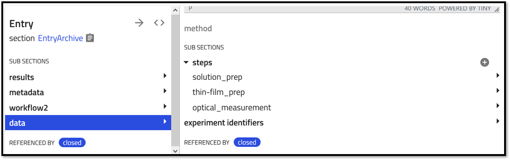
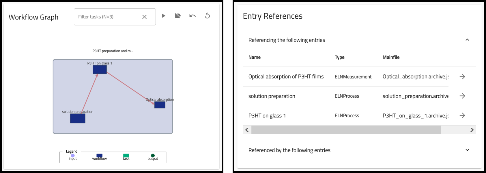

# Integrating your experiment using the *experiment ELN* schema

In this section you will learn how to create NOMAD entries for the entire experimental workflow that links processes and measurements to provide a comprehensive overview of your experiment. You will use the NOMAD built-in schema called *Experiment ELN* and explore the various fields you can fill in and the information you can add to NOMAD.

Based on the example described earlier, we will need to create and entry that includes (reference) the following entires as steps:

1. Preparing P3HT solutions.

2. Depositing P3HT thin-films on glass substrate.

3. Measuring the optical absorption spectroscopy.

> For general steps on how to create records in NOMAD using the built-in ELN schema, please refer to the [Getting strated](M3_2_0_getting_started.md) page. When you reach step 8, select *Experiment ELN* from the drop down menu, enter a name for your record, and click Create.

After clicking the Create button, NOMAD will automatically perform the following tasks:
1. NOMAD creates a file for the entry, using the format *.archive.json*.
2. The entry file is stored in the main upload directory. 
3. NOMAD will open the entry, switch to the *data* tab, and open the *data* sub-sections page. 

The *data* sub-sections page allows user input to fill in the information about the experiment. 

The built-in Experiment ELN schema provides general fields that allow the entry of various quantities: 
* Short Name: This is the name of the record file created.

* Datetime: Allows input for a date/time stamp. 

* ID: A human readable ID that is unique to the substance within the lab. 
can be entered manually.

* Description: A free text field that can be used to enter any additional information about the entry. 

> Remember that this is your ELN and you are using a built-in schema that was created to be as generic as possible to accommodate as many users as possible. You can use the different fields however you like. For example, the Description field can be used to add any batch information, lab conditions, storage location, etc.

The Experiment ELN allows you to include the steps of your experiments by using the steps sub-section. 

The steps sub-section can be found at the bottom of the Entry/Data/Data page.

To begin adding steps to your experiment, click on the **+** icon next to the steps sub-section.

This action will open a new data entry panel where you can input the following details:

- **step name:** Provide a descriptive name for your step.
- **activity:** Reference the activity entry related to this step in your experiment. You can either select an existing entry or create a new one on the fly using the **+** icon. 
- **starting time:** Specify when the step begins.
- **activity ID:** Provide the unique identifier for the activity.
- **comment:** A rich text editor to include any extra information.

Lets proceed by adding the activity steps mentioned above and thier relevant information to our experiment.

1. Activity 1: Solution preparation 
2. Activity 2: P3HT on glass
3. Actvity 3: Optical absorption of P3HT films

After each adding each activity, make sure you click on the **save** icon, then proceed to add the next activity by clicking on the **+** icon next to the *steps* subsection. 

Once you are done, you can see the steps are listed under the steps subsection. 

> **Important note:** In the *Experiment ELN* you can only add steps of activitiy schemas, that is, entries created with the *Process ELN* and *Measurement ELn*. Substances and samples can be already nested within those enties. 

These steps will be used to automatically fill in the Workflow section as tasks, as well as the References section, which can be viewed in the *Overview* page.

You can now interact with the workflow graph to view the details of each of the steps in your experiment. 

