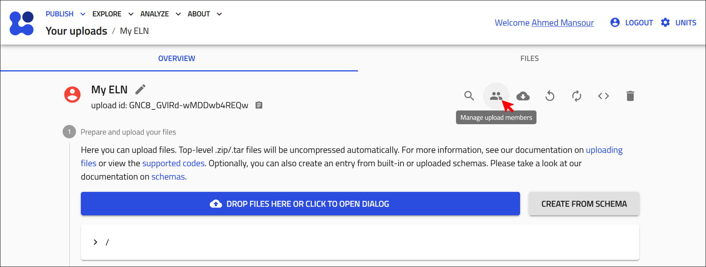
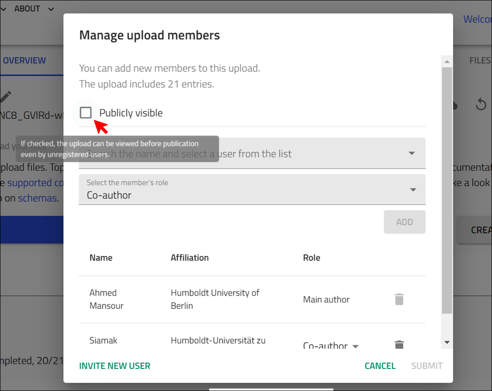

# Collaborating on Your ELN

One key advantage of using an ELN over traditional paper lab books is the ability for multiple collaborators to simultaneously record and update experimental work on the same platform. It helps with keeping everyone up-to-date and promotes seamless communication and coordination.  This approach keeps everyone up-to-date and promotes seamless communication and coordination. By sharing progress in real-time, team members and leaders can provide timely feedback and support. 

In this section, you will learn how to share your NOMAD ELN with your colleagues to maximize collaboration and efficiency.

## Sharing Your ELN

NOMAD enables you to share your ELN by a dedicated access management function of your upload. 

??? info "Access Management in NOMAD"

    Access management in NOMAD ELN operates on the upload level. This means that once you share your upload with someone, they can access all the entries within that upload. 

To share your ELN, click on the **Manage upload members** icon. 

    

Next, the user management prompt will appear, allowing you to add your colleagues.

To grant access to your ELN, start typing the name of the user you wish to add, then select them from the drop-down list. Note that the user must have a NOMAD account to be listed.

After selecting a user, you'll need to assign their role. Choose between **Co-author** or **Reviewer**, based on the level of access you want to provide:

- **Co-author**: Can create, edit, and delete entries within the upload.
- **Reviewer**: Has read-only access to the entries.

Click **SUBMIT** ! 

    

## Inviting Colleagues to Create a NOMAD Account to Access Your ELN. 

If you want to add a co-author or share your data with someone that is not already a NOMAD user, you can invite them by providing a few details. The invited person will then receive an Email to set a password and complete their profile, allowing you to add them as a co-author or share data immediately.

## Make Your ELN Publicly Visible

In NOMAD's ELN, the **Publicly visible** option allows you to share your ELN with everyone *without officially publishing it or making it immutable*. In other words, this option enables public access for *viewing purposes only*, i.e., allowing your team or collaboraters to access your data without commiting to a permanent, uneditable publication status. This feature is especially useful during collaboration phases, where you want your team members to access and view your data freely, even without a NOMAD account, but you still want to retain control over further edits and changes.

    

