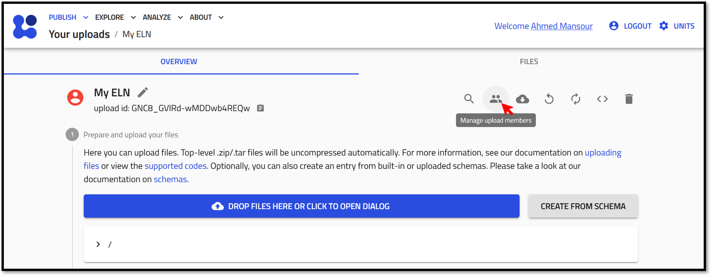
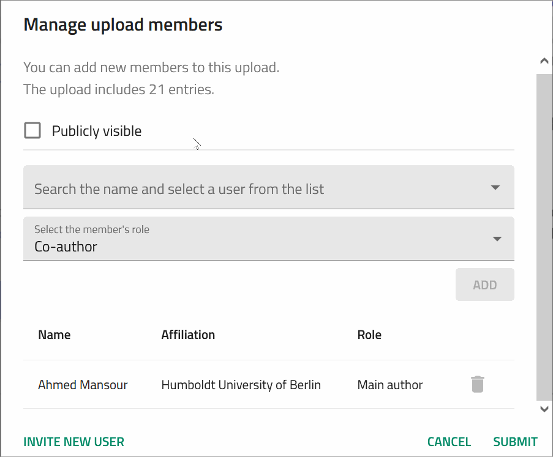
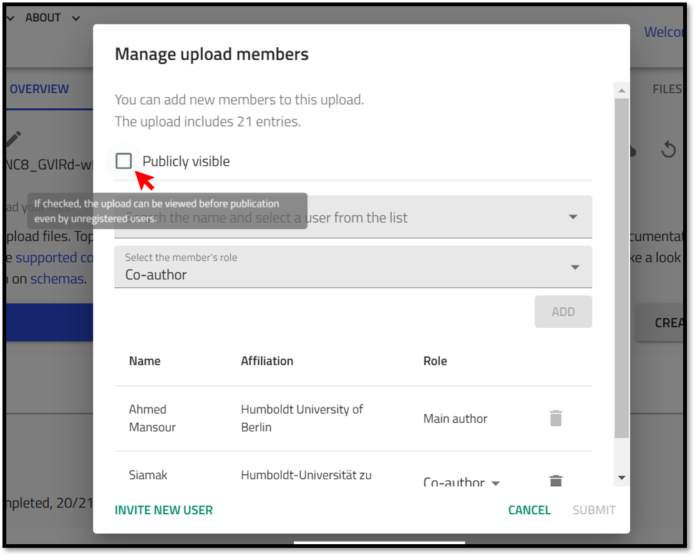

# Collaborating on Your ELN

One key advantage of using an ELN over traditional paper lab books is the ability for multiple collaborators to simultaneously record and update experimental work on the same platform. This not only streamlines collaboration but also ensures that all team members have access to the latest data in real-time.

Moreover, group leaders can easily monitor progress and provide timely feedback, keeping the project on track and aligned with research goals.

In this section, you will learn how to share your NOMAD ELN with your colleagues to maximize collaboration and efficiency.

## Sharing Your ELN

NOMAD enables you to share your ELN by a dedicated users management function of your upload. 
> User management in NOMAD ELN operates on the upload level. This means that once you share your upload with someone, they can access all the entries within that upload. 

To share your ELN, click on the *Manage upload members* icon. 

Next, the user management prompt will appear, allowing you to add your colleagues.

To grant access to your ELN, start typing the name of the user you wish to add, then select them from the drop-down list. Note that the user must have a NOMAD account to be listed.

After selecting a user, you'll need to assign their role. Choose between "Co-author" or "Reviewer," based on the level of access you want to provide:

- Co-author: Can create, edit, and delete entries within the upload.
- Reviewer: Has read-only access to the entries.

Click submit! 

## Inviting Colleagues to Create a NOMAD Account to Access Your ELN. 

If you want to add a user as co-author or share your data with someone that is not already a NOMAD user, you can invite this person. You will need to provide just a few details about this person. After your invite, the new user will receive an Email that allows them to set a password and further details. You will be able to add the user as co-author or someone to share with immediately after the invite.

## Make Your ELN Publicly Visible

In NOMAD's ELN, the **Publicly Visible** option allows you to share your ELN with everyone without making it officially published or immutable. This feature is especially useful during collaboration phases, where you want your team members to access and view your data freely, even without a NOMAD account, but you still want to retain control over further edits and changes.

Making your ELN publicly visible means that it will appear on the **Explore** page on the public NOMAD. 

