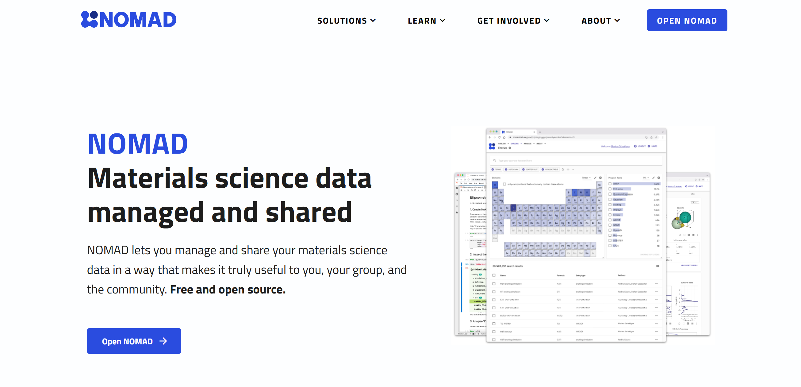
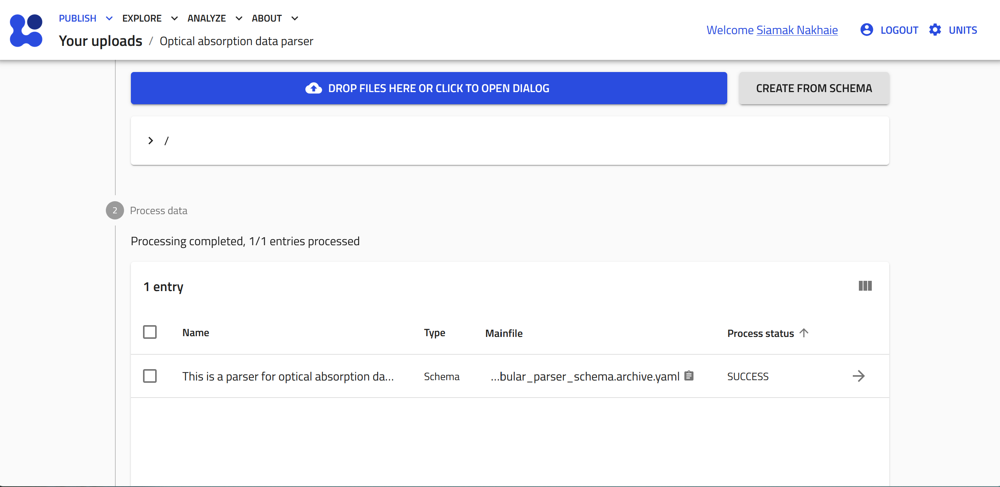
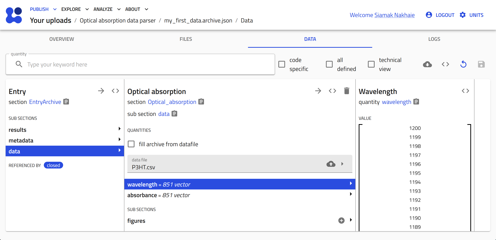
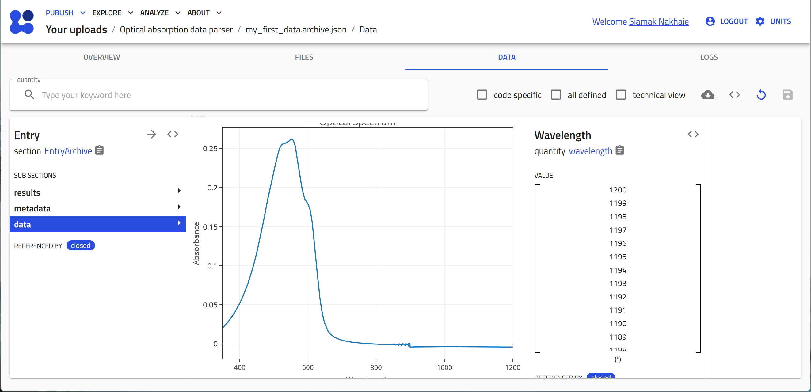

<!-- ## uploading experimental measurement data files to your ELN -->

# Adding Characterization Data Files to Your NOMAD ELN

In this section, we will explore the process of documenting experiments within the NOMAD ELN, focusing on the essential step of uploading characterization results along with sample and processing information.

Within NOMAD, any file type can be added seamlessly through the ELN upload feature. However, to take full advantage of NOMAD's capabilities, it is critical that data files become Entries. These Entries are processed by NOMAD, transforming them into structured data that allows for metadata extraction, visualization, and analysis.

## Objective

Our objective is to upload these files into our ELN, make NOMAD parse the data within these files, and then visualize the data in plots that can be viewed in NOMAD.

## File Handling in NOMAD

In NOMAD, uploaded files are categorized into two main types: **raw files** and **processed data files**. This distinction is critical to understanding how NOMAD handles and interprets your data.

To facilitate this process, NOMAD is continually expanding its support for various data formats. This support ensures that NOMAD users have access to parsers designed to read specific data formats seamlessly.

??? details "What is a parser in NOMAD?"

    Think of it as a specialized tool in the NOMAD toolkit. Parsers are small programs designed to take a file as input and produce processed data. They play a crucial role in transforming information from various source formats into NOMAD's structured, schema-based format. Each parser is tailored to a specific file format and is designed to handle data files of that format. In addition, the parsers are able to navigate through multiple files, such as those referenced in the main file, to ensure comprehensive data processing.

## Supported Data Categories

NOMAD supports two main categories of data: Theory and Computations data and Measurement (spectroscopy) data.

**Theory and Computations Data:**
For a comprehensive list of codes and related file formats supported in NOMAD, please visit this [page](https://nomad-lab.eu/prod/v1/staging/docs/reference/parsers.html){:target="_blank"}.

**Measurement (Spectroscopy) Data:**

- For generic tabular data in '.csv' and '.xlsx' formats, NOMAD offers a flexible tabular parser that adapts to the structure of the data within the file.
- For Optical Absorption Spectroscopy, NOMAD supports '.asc' files from PerkinElmer Lambda instruments.
- For X-ray Diffraction, NOMAD supports the following file formats:
  
    - '.xrdml' files from Panalytical instruments.

    - '.rasx' files from Rigaku instruments.

    - '.brml' files from Bruker instruments.

## Using NOMAD's Tabular Parser

In the following sections, we'll explore how to utilize NOMAD's tabular parser effectively to enhance your data documentation and visualization.

It is very common to export measurement data into a tabular format such as .csv or .xlsx.

NOMAD offers a versatile tabular parser that can be configured to process tabular data with different representations, such as data arranged in columns or rows.

- Columns: each column contains an array of cells that we want to parse into one quantity. Example: current and voltage arrays to be plotted as x and y.
  
- Rows: each row contains a set of cells that we want to parse into a section, i.e., a set of quantities. Example: an inventory tabular data file (for substrates, precursors, or more) where each column represents a property and each row corresponds to one unit stored in the inventory.

More details on the different representations of tabular data can be found [here](https://nomad-lab.eu/prod/v1/staging/docs/howto/customization/tabular.html){:target="_blank"}.

## Steps to Upload and Visualize Data

In this workshop, we will work with measurement data from optical absorption spectroscopy and conductivity measurement stored in a the tabular format '.csv', with the columns representations shown in the figure below. 


<div style="text-align: center;">
    
</div>


Our objective is to upload these files into our ELN, make NOMAD parse the data within these files, and then visualize the data in plots that can be viewed in NOMAD. 

To achieve this, we will write a schema using the YAML language, and then illustrate how it can be used as ELN in NOMAD. 

### **Step 1: Defining and Saving the Schema File**

Let's start by creating a new schema file with the `.archive.yaml` format, and create a section called Optical_absorption.

```yaml
definitions:
  name: This is a parser for optical absorption data in the .csv format
  sections:
    Optical_absorption:
```
### **Step 2: Adding the Needed Base Sections**

The next step is to inherit the base sections to meet our ELN needs. 

- To create entries from this schema we will use  `nomad.datamodel.data.EntryData`
- To use the tabular parser we will use
`nomad.parsing.tabular.TableData`
- To enable the plot function we will use
`nomad.datamodel.metainfo.plot.PlotSection` 

### **Step 3: Defining the Quantities of Our Schema**

We will define the quantities in our ELN schema. Three quantities are needed:

- A quantity to allow the upload of the data file, and apply the tabular parser to transform the data into NOMAD structure. Let's call this `data_file`.
- A quantity to store the values of our x-axis coming from the tabular parser. Let's call this `wavelength`.
- A quantity to store the values of our y-axis coming from the tabular parser. Let's call this `absorption`.

At this stage our schema file will look like this:

```yaml
definitions:
  name: This is a parser for optical absorption data in the .csv format
  sections:
    Optical_absorption:
      base_sections:
        - nomad.datamodel.data.EntryData
        - nomad.parsing.tabular.TableData
        - nomad.datamodel.metainfo.plot.PlotSection
      quantities:
        data_file:
          type: str
          descritpion: Upload your .csv data file
        wavelength:
          type: np.float64
          shape: ['*']
        absorbance:
          type: np.float64
          shape: ['*']

```
<!-- Do you think it is worth mentioning any of the following:
- Why data_file is read as 'str' type.
- what does "shape: ['*']" mean?
- why unlike last page we don't assign units?

e.g., - The `data_file` is of type `str` because it represents the path or name of the uploaded file as a string, used for referencing the file within NOMAD.

- The **"shape: ['*']"** means that the data is a one-dimensional array with a flexible number of elements.

- Units are not assigned to `wavelength` because ... -->

### **Step 4: Instructing NOMAD on How to Treat Different Quantities**

For this, we use the `m_annotations` function within each of the quantities to perform the intended task. 

* **The `data_file` quantity:** 

We will need three annotations:

\- The first is to instruct NOMAD to allow for droping and selecting files in this quantity.
Here we will use the following: 

```yaml
eln:
    component: FileEditQuantity
```

\- The second is to instruct NOMAD to open the operating system's data browser to select files:

```yaml 
browser:
    adaptor: RawFileAdaptor
```

\- The third one instructs NOMAD to apply the tabular parser to extract the data from the uploaded file:

```yaml
tabular_parser:
    parsing_options:
        comment: '#'
        skiprows: [1]
    mapping_options:
        - mapping_mode: column
            file_mode: current_entry
            sections:
            - '#root' 
```


<!--  I understand and agree that we cannot and should not explain everything. But probably it would be better to give some references to learn more about parsing_options, or mapping_options, e.g., https://nomad-lab.eu/prod/v1/docs/reference/annotations.html#tabular_parser , although it is defenitely not targeted for average users.-->


Those interested in learning more about `parsing_options` and `mapping_options` can find additional details in the official [NOMAD documentation](https://nomad-lab.eu/prod/v1/docs/reference/annotations.html#tabular_parser){:target="_blank"}.


**The `wavelength` quantity:**

This quantitiy will accept the values from the first column of our tabular data file, that will be extracted by the tabular parser. 

For this purpose we will use the following annotation:

```yaml
tabular:
    name: Wavelength
```
Note that the value for the `name` key should be exactly written as the *header of the first column in the data file*. 

**The `absorbance` quantity:**

This quantitiy will accept the values from the second column of our tabular data file, that will be extracted by the tabular parser. 
For this purpose we will use the following annotation:
```yaml
tabular:
    name: Absorbance
```
Note that the value for the `name` key should be exactly written as the *header of the second column of the data file*. 

Our schema file at this stage will look as follows:

```yaml
definitions:
  name: This is a parser for optical absorption data in the .csv format
  sections:
    Optical_absorption:
      base_sections:
        - nomad.datamodel.data.EntryData
        - nomad.parsing.tabular.TableData
        - nomad.datamodel.metainfo.plot.PlotSection
      quantities:
        data_file:
          type: str
          descritpion:
            Upload your .csv data file
          m_annotations:
            eln:
              component: FileEditQuantity
            browser:
              adaptor: RawFileAdaptor
            tabular_parser:
              parsing_options:
                comment: '#'
                skiprows: [1]
              mapping_options:
                - mapping_mode: column
                  file_mode: current_entry
                  sections:
                    - '#root'    
        wavelength:
          type: np.float64
          shape: ['*']
          m_annotations:
            tabular:
              name: Wavelength
        absorbance:
          type: np.float64
          shape: ['*']
          m_annotations:
            tabular:
              name: Absorbance
```

### **Step 5: Creating a Plot for Your Data**
To visualize the data from the uploaded and parsed file within your ELN, we will use an annotation for the main section of our schema `Optical_absorption`

By using the `plotly_graph_object` annotation we instruct NOMAD which quantities to use for the x-axis and the y-axis, as well as provide the title of the plot. Within the `plotly_graph_object` annotation, the `data` key defines the quantites for each axis. Here, these varaiable names match those which are defined in the schema.
Finally, plot's title is set using the `layout` key.

```yaml
plotly_graph_object:
    - data:
        x: "#wavelength" 
        y: "#absorbance" 
    layout:
        title: Optical Spectrum
```

At this stage the schema file will be written as follows: 

``` yaml 
definitions:
  name: This is a parser for optical absorption data in the .csv format
  sections:
    Optical_absorption:
      base_sections:
        - nomad.datamodel.data.EntryData
        - nomad.parsing.tabular.TableData
        - nomad.datamodel.metainfo.plot.PlotSection
      quantities:
        data_file:
          type: str
          descritpion:
            Upload your .csv data file
          m_annotations:
            eln:
              component: FileEditQuantity
            browser:
              adaptor: RawFileAdaptor
            tabular_parser:
              parsing_options:
                comment: '#'
                skiprows: [1]
              mapping_options:
                - mapping_mode: column
                  file_mode: current_entry
                  sections:
                    - '#root'                        
        wavelength:
          type: np.float64
          shape: ['*']
          m_annotations:
            tabular:
              name: Wavelength
        absorbance:
          type: np.float64
          shape: ['*']
          m_annotations:
            tabular:
              name: Absorbance
      m_annotations:
              plotly_graph_object:
                data:
                    x: "#wavelength" 
                    y: "#absorbance" 
                layout:
                  title: Optical Spectrum
```

### **Step 6: Uploading the Schema File to NOMAD and Creating an Entry**

Now that we have created the ELN schema file for parsing the optical absorption data file, let's put it into the test in the NOMAD GUI. Follow this sequence to complete the process:

<!-- 
<iframe src="https://scribehow.com/shared/Creating_a_NOMAD_schema_to_parse_tabular_data__hM8UugxXR8CY-U9qIL-dUw?skipIntro=true" width="100%" height="640" allowfullscreen frameborder="0"></iframe>
-->

1.  Navigate to [NOMAD](https://nomad-lab.eu/nomad-lab/){:target="_blank"} and start NOMAD by clicking on the **OPEN NOMAD** button.

    <div style="text-align: center;">
        
    </div>

2. Click "Uploads" under the "PUBLISH" menu.

    <div style="text-align: center;">
        
    </div>

3.  Click "CREATE A NEW UPLOAD".
    <div style="text-align: center;">
        
    </div>

4. Give a name to your upload by clicking on the pen button. Type the desired name then click **SAVE**. Then click **DROP FILES HERE OR CLICK TO OPEN DIALOG** and select the schema file (the ".archive.yaml" file you just prepared) or simply drag and dropthe file here.

    <div style="text-align: center;">
        
    </div>

5. The file will be uploaded and processed by NOMAD, the process status will appear as SUCSESS. Then, to create an entry and upload the data file, click **CREATE FROM SCHEMA**.

    <div style="text-align: center;">
        
    </div>


6. Select the "Custom schema" radiobox, and then click the mangifying glass button to browse the available custom schema.

    <div style="text-align: center;">
        
    </div>

7. Click "Only this upload" radiobox. You see now the custom schema you have just uploaded. Click on it and then select its name, "Optical_absorption" to be instantiated.

    <div style="text-align: center;">
        
    </div>

8. Add a name to your entry, e.g., my_first_data, and click **CREATE**.

    <div style="text-align: center;">
        
    </div>

9.  The entry is now created based on our schema. In the "DATA" tab click on the cloud button to open the system browser and select your data file.

    <div style="text-align: center;">
        
    </div>

10. Click save to start the tabular parser. The columns from the data file are now transformed to array values in the quantities that were defined in the schema.

    <div style="text-align: center;">
        
    </div>

11. You can click on the quantities, i.e., wavelength and absorbance, to view the data

    <div style="text-align: center;">
        
    </div>

12. The plot will be also visible if you scroll down.

    <div style="text-align: center;">
        
    </div>