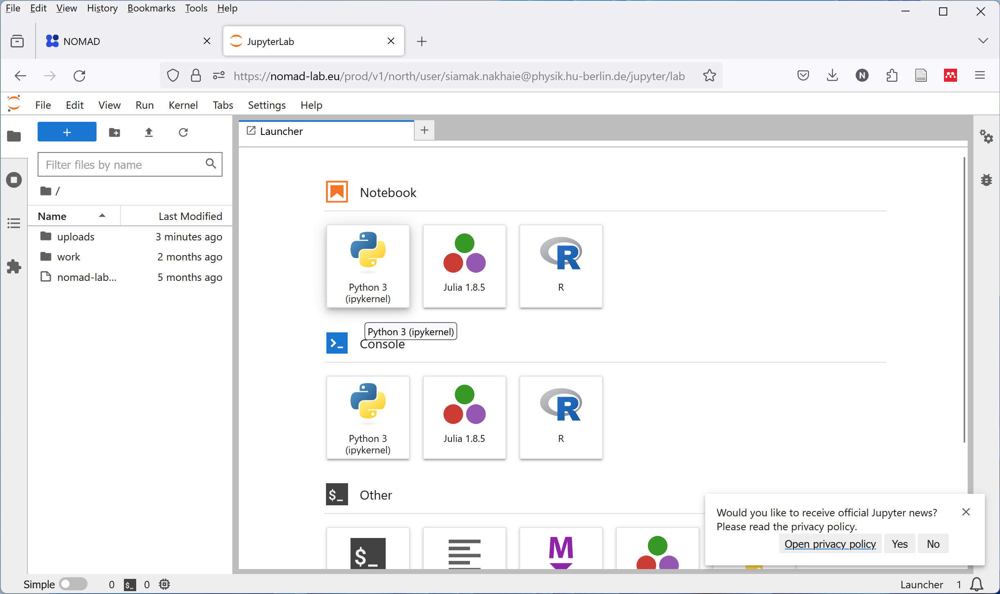

## The NOMAD Remote Tools Hub (NORTH)

NORTH allows you to run pre-configured applications directly on the NOMAD servers. With NORTH, you can access, analyze, and create data directly in your uploads using your favorite tools with no setup required..

In this section, you will learn how to access and use the Jupyter Notebook interface via the NOMAD Remote Tools Hub (NORTH). Follow these steps to get started:

1.  Begin by visiting the [NOMAD homepage](https://nomad-lab.eu/nomad-lab/). Once there, open NOMAD to reach the main interface.

2.  Navigate to the 'ANALYZE' section, which you'll find at the top of the page. Here, click on `'NOMAD Remote Tools Hub'` to access the remote tools available to you.

3.  To use NORTH, you need to be logged in. Click on 'LOGIN / REGISTER' to proceed. If you are not yet registered, now is the right the time to join the NOMAD community.
 

4.  Once you are logged in, start a new session by selecting 'Jupyter Notebook: The Classic Notebook Interface'.

    > **Note:** If a new page does not automatically appear, check to see if pop-ups are allowed in your browser, as this might prevent the notebook from opening.
    

5.  Choose the 'Python 3' kernel to begin your session, which is the environment where you can run Python code.

6.  Now you have everything you need. A Jupyter Notebook page opens, equipped with (almost) all the libraries you need. This is where you can analyze data, visualize results, or interact with the NOMAD API.

