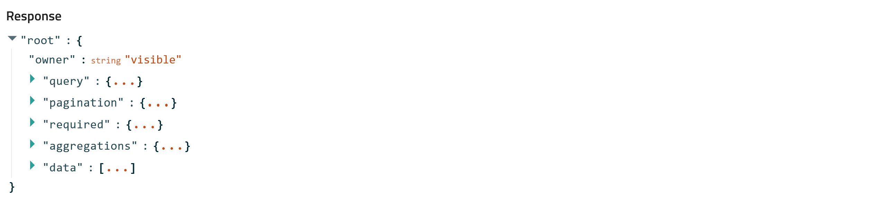

# Using the API helper in the Explore Page

In this section, you will learn how to:

* Find the exact POST request, after you applied filters in explore page.
* Inspect the response to find your requested piece of data.
* Download the API response using the GUI.

Let's consider [our first basic example](../M4_2_1_example_api_explained.md). Suppose we want to find the `entry_id` of entries that contain both Ti and O in their chemical formula, this time using the NOMAD GUI. 

## Finding the POST Request

1. Open NOMAD, from the **EXPLORE** menu select **Entries** to go to the [explore page](https://nomad-lab.eu/prod/v1/gui/search/entries){:target="_blank"}.
2. On the left sidebar under **FILTERS**, click on **Elements / Formula** and select 'Ti' and 'O' in the periodic table that opens as a submenu. On top of the periodic table you can see how many entries match your search criteria.
3. Locate the API symbol (**<>**) at the top of the page and click on it.[^1]
4. A new page opens showing a query independent of the actual request. Scroll down, under **Request**, you will find the related POST request to the `entries/query` endpoint. This request body, similar to the `request_data` in [[our first example]](../M4_2_1_example_api_explained.md), is a JSON object containing `owner`, `query`, `aggregations`, `pagination`, and `required` parts.

The request body should look like this:
```json
{
  "owner": "visible",
  "query": {
    "results.material.elements:all": [
      "Ti",
      "O"
    ]
  },
  "aggregations": {...},
  "pagination": {
    "order_by": "upload_create_time",
    "order": "desc",
    "page_size": 20
  },
  "required": {
    "exclude": [
      "quantities",
      "sections",
      "files"
    ]
  }
}
```

* The `owner` is set to `visible`, meaning all entries visible to you.
* The `query` includes the filters applied in the GUI (materials containing Ti and O).
* The `aggregations` define how data is displayed, e.g., histograms. 
* The `required` section excludes specific data fields (`quantities`, `sections`, and `files`)

## Inspecting the Response

Scroll down further to reach **Response**. The response body in the GUI in the compact view looks like this:




The `data` section contains our requested data. Once expanded, you see entries listed from 0 to 19 (since `page_size` is 20). Once you expand each of these entries, you can find its `entry_id` close to the bottom of the expanded list.

## Downloading the Response Using the GUI

To get the response data in JSON format, use the API Dashboard:

1. Copy the POST request **body** to your clipboard.
2. Navigate to the API Dashboard, find the **`entries/query`** endpoint under **entries/metadata**.
3. Click on **Try it out** button, replace the existing body with your copied request body, and click **Execute**.
4. If you want faster results, reduce the `page_size` to a smaller value, e.g., 1.
   
After execution, scroll down and you will see a successful response (code 200). Look for the `entry_id` under `data` in the response. You can download this response as a JSON file using the **Download** button at the bottom-right of the response window.


Notice, the response data we received contains various other information in addition to our desired one, the `entry_id`. It actually contains all the information that the `entries/query` endpoint provides, excluding `quantities`, `sections`, and `files`.

To retrieve only the `entry_id`, modify the `required` part to include only `entry_id` (in a python list), set `page_size` to 1, and remove `aggregations`. Your request body should look like this:

```json
{
  "owner": "visible",
  "query": {
    "results.material.elements:all": [
      "Ti",
      "O"
    ]
  },
  "pagination": {
    "order_by": "upload_create_time",
    "order": "desc",
    "page_size": 1
  },
  "required": {
    "include": [
      "entry_id"
    ]
  }
}

```

Executing this will give a response similar to:

```json
{
  "owner": "visible",
  "query": {
    "results.material.elements:all": [
      "Ti",
      "O"
    ]
  },
  "pagination": {
    "page_size": 1,
    "order_by": "upload_create_time",
    "order": "desc",
    "total": 41544,
    "next_page_after_value": "1717097142713:zIaQ0vsZ0bx4tE8n6L7pDK7SyM-k"
  },
  "required": {
    "include": [
      "entry_id",
      "upload_create_time"
    ]
  },
  "data": [
    {
      "upload_create_time": "2024-05-30T19:25:42.713000+00:00",
      "entry_id": "zIaQ0vsZ0bx4tE8n6L7pDK7SyM-k"
    }
  ]
}

```
You can download this JSON object and use it programmatically to extract the `entry_id`.


Remember, the API dashboard is a helper tool, not the most efficient or fastest way to use the API. It helps you understand the **correct request body** and the **relevant endpoint**. To explore available information from this endpoint (or other endpoints), we can remove the `required` field completely, or set it to `"required": {}`, and use `"page_size": 1` to obtain all possible information from the endpoint.


---
[^1]: The placement of the API symbol may differ slightly from the animated screenshot provided, as it is currently located on the top right of the explore page in the updated GUI.