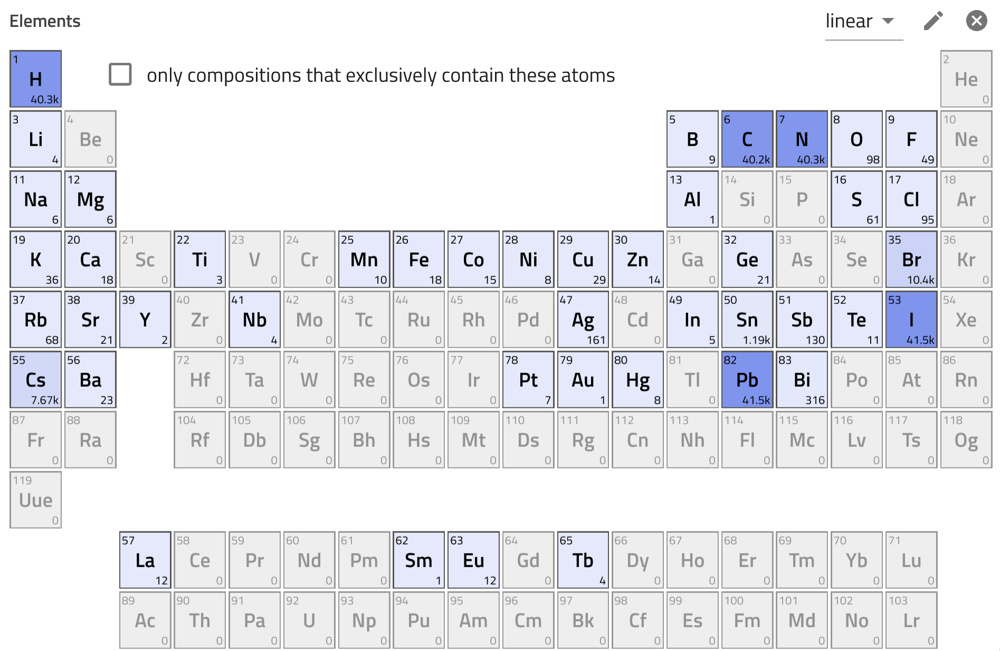
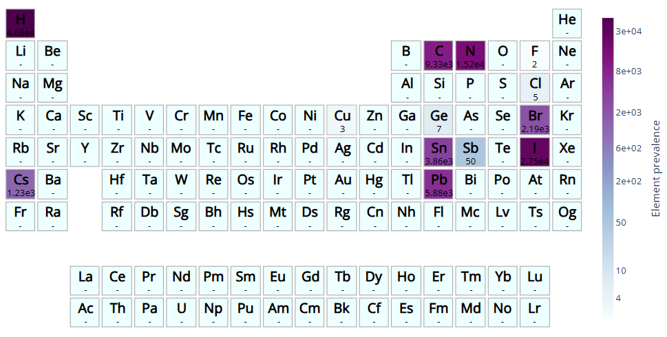

# Prepare Data for Modeling

In the [previous section](M4_x_1_perovskites_crabnet_retrieve_data_api.md), we retrieved perovskite solar cell data using the NOMAD API, converted it to a Pandas DataFrame, and saved it as **perovskite_bandgap_devices.csv** in the **data** folder. If you already have the data, you can start from this section, where we will import and clean it.

## EDA and Data Cleaning

Exploratory Data Analysis (EDA) is a useful step in understanding and preparing datasets for modeling by summarizing data, checking for anomalies, finding patterns and relationships.

### Insights from NOMAD GUI

The distribution of chemical diversity of the dataset can be explored using the [periodic table in the NOMAD solar cell app](https://nomad-lab.eu/prod/v1/gui/search/solarcells){:target="_blank"}. The bottom-right corner of each element displays the number of entries (solar cells) that include the element in the absorber. The dataset is notably imbalanced, with the majority of entries being Pb-based, containing C, N, H (hybrid perovskites), and halides like I and Br.

<div style="text-align: center;">
    
</div>


### Load Data

Let's load the data into a Pandas DataFrame, make sure the bandgap column is numeric, and adjust its units from Joules to electronvolts.


```python
import pandas as pd

df = pd.read_csv('data/perovskite_bandgap_devices.csv')
df['bandgap'] = pd.to_numeric(df['bandgap'], errors='coerce')
df['bandgap'] = df['bandgap']*6.24150974e18
df.head()
```

Let's have a look on the statistical summary of the dataset:

```python
df.describe()
```

We can see that the dataset contains a diverse range of bandgap values (1.16 to 2.70 eV). Some parameters such as open circuit voltage (voc) and fill factor (ff), include extreme or zero values, which might need attention for data cleaning.

### Remove `NaN`s

The dataset might include missing values, let's check if there are any:

```python
df.isna().sum()
```
Let's now keep part of the dataframe, where the value for bandgap is not `Na`.

and remove them:

```python
df = df[df['bandgap'].notna()]
```
### Group Repeated Formulas

Even before checking the dataset, we can already guess that are many repeated formulas and bandgap values in the DataFrame. But let's verify it:

```python
df['reduced_formulas'].value_counts().head(10)
```

The dataset contains many repeated formulas and corresponding bandgap values. To make sure each formula is unique, we will use the [`groupby_formula`](https://crabnet.readthedocs.io/en/latest/crabnet.utils.html#crabnet.utils.data.groupby_formula){:target="_blank"} function from CrabNet to group entries by their formulas and use the mean values for their bandgap. We make a new final DataFrame for our model, call it `df_reduced_formula` and adjust colum names etc.

Let's rename columns and use the **gourpby_formula** function from CrabNet:

```python
from crabnet.utils.data import groupby_formula

# Rename the column 'bandgap' to 'target'
df.rename(columns={'bandgap': 'target'}, inplace=True)
df.rename(columns={'reduced_formulas': 'formula'}, inplace=True)

# Group repeated formulas and take the mean of the target
df_grouped_formula = groupby_formula(df, how='mean')
df_grouped_formula.head()
```

Let's check the shape of the datafram:

```python
df_grouped_formula.shape
```


### Check Element Prevalence 

We will use `pymatviz` ([link to docs](https://pymatviz.janosh.dev/){:target="_blank"}) for visualizing the element prevalence.

Run the following snippet if the package is not installed in the environment yet, otherwise skip it.

You can simply try

```python
!pip install pymatviz
```
in case of problems, try it from its developer repo

```python
!pip install git+https://github.com/janosh/pymatviz
```

Once installed, we import and use it:

```python
from pymatviz import ptable_heatmap_plotly

ptable_heatmap_plotly(df_grouped_formula['formula'], log=True, colorscale='BuPu', font_colors='black', fmt='.3g', colorbar=dict(orientation="v", title= 'Element Prevalence'))
```
<div style="text-align: center;">
    
</div>

As you can see the current data is heavily based on hybrid halide perovskites, so we expect the model to perform better when predicting these materials. Let's continue and build the model in the next section!